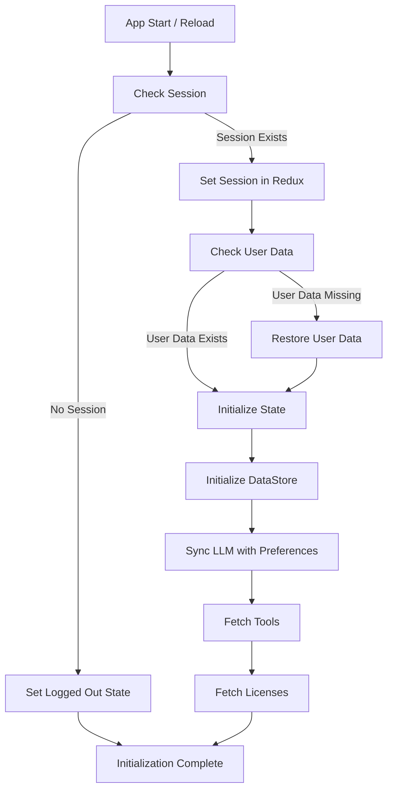

# App Initialization Pattern

This document describes the centralized app initialization pattern implemented in the application.

## Overview

The app uses a centralized initialization pattern to ensure that authentication is completed first, followed by the initialization of other state slices like dataStore, llm, and tools. This pattern provides several benefits:

1. **Sequential Execution**: Authentication is completed before other state initialization
2. **Centralized Control**: A single thunk orchestrates the entire initialization flow
3. **Improved Error Handling**: Centralized error handling for the initialization process
4. **Better Loading States**: Unified loading state for the entire initialization process

## Implementation

The implementation consists of two main parts:

### 1. The `initializeApp` Thunk in `appSlice.js`

This thunk orchestrates the entire initialization flow:

```javascript
export const initializeApp = createAsyncThunk(
  'app/initializeApp',
  async (_, { dispatch, getState }) => {
    // Step 1: Check and restore session
    // Step 2: Restore user data if needed
    // Step 3: Initialize other state slices (dataStore, llm, tools)
  }
);
```

The thunk follows these steps:

1. **Authentication**: Check and restore the user session
2. **User Data**: Restore user data if a session exists but user data is missing
3. **State Initialization**: Initialize dataStore, llm, tools, and licenses sequentially after authentication is complete

### 2. App Component Integration

The App component dispatches the `initializeApp` thunk on startup:

```javascript
useEffect(() => {
  dispatch(initializeApp())
    .unwrap()
    .then(result => {
      // Initialization completed
    })
    .catch(error => {
      // Initialization failed
    });
}, [dispatch]);
```

The UI shows appropriate loading states during initialization.

## Initialization Flow



## Error Handling

The initialization process includes comprehensive error handling:

1. **Individual Service Failures**: If one service fails to initialize (e.g., tools), the initialization continues with other services
2. **Critical Failures**: Authentication failures are considered critical and will stop the initialization process
3. **Error Reporting**: All errors are logged and stored in the Redux state

## State Management

The app slice maintains initialization state:

```javascript
initialization: {
  status: 'idle', // 'idle', 'loading', 'succeeded', 'failed'
  error: null
}
```

This state is used to show appropriate UI during initialization.

## Extending the Pattern

To add a new service to the initialization flow:

1. Create an initialization thunk for the new service
2. Add it to the sequential initialization steps in the `initializeApp` thunk
3. Handle success and error cases appropriately

## Benefits

This pattern provides several benefits:

1. **Cleaner Code**: Centralized initialization logic instead of scattered useEffect hooks
2. **Better User Experience**: Proper loading states during initialization
3. **Improved Error Handling**: Centralized error handling for initialization
4. **Maintainability**: Easier to add new services to the initialization flow
5. **Debugging**: Clearer initialization flow makes debugging easier