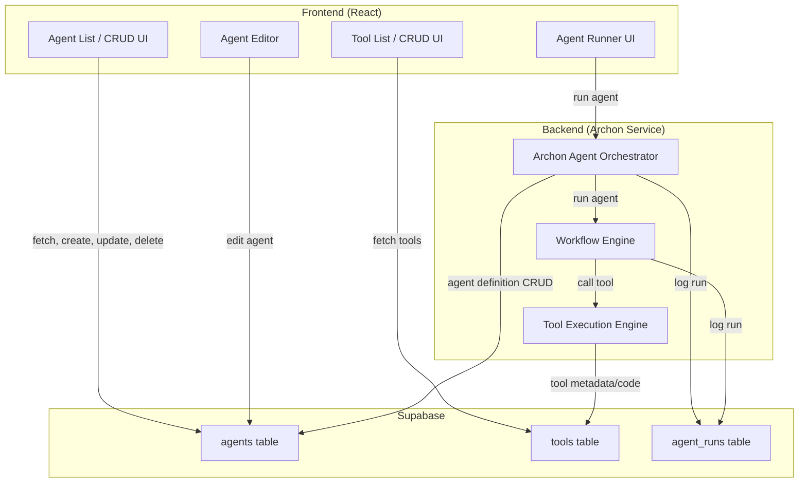

# Archon Integration Plan

## 1. Overview

- **Agents** will be managed like tools: CRUD operations, stored in Supabase, and surfaced in the UI.
- **Agents** will be able to call existing tools and compose workflows.
- **Orchestration logic** (agent execution, workflow management) will reside in the backend.
- The frontend will provide management and invocation interfaces, similar to tools.

## 2. High-Level Architecture



## 3. Steps for Integration

### 3.1. Database Schema

- **agents table**: Store agent definitions (name, description, code/config, owner, etc.)
- **agent_runs table**: Track agent executions, status, logs, results, etc.
- **agent_tools table**: list available tools from tools table or agents (as subagents) from the agents table.

### 3.2. Backend (Archon Service)

- Deploy Archon as a backend service.
- Extend Proxy Server to manage communciation with Archon
- Implement/Integrate with endpoints for:
    - CRUD operations on agents (integrate with Supabase)
    - Agent execution (run agent, return results, log runs)
    - Workflow orchestration (agents can call tools, chain steps, etc.)
    - Tool invocation (reuse or extend existing tool execution logic) (use existing implmentation)
- Ensure secure execution and resource isolation for agent code.

### 3.3. Frontend

- Add "Agents" section to the UI, mirroring the "Tools" section:
    - List, create, edit, delete agents.
    - View agent details, code/config, and run history.
    - UI to run agents and view results/logs.
- Allow agents to be composed visually or via code (e.g., JSON/YAML/DSL or code editor).
- Enable selection of tools and subagents for agent workflows.
- Create setting for developer to review agent flow from fully nanny state - where every call and response is reviewed and approved prior to next call,  through to fully autonimous where Agent is allowed to run uninterupted at full speed through a serious of approval switches in agent settings

### 3.4. Tool-Agent Integration

- Agents should be able to execute tools using the toolSlice. (See ToolPlayground for manual implementation)
- Allow agents to define workflows that invoke tools in sequence or conditionally.
- Support agent-to-agent calls for advanced workflows.

### 3.5. Security & Resource Management

- Ensure all tool and agents are called via proxy server on the users lcoal environment. The intended audience here are developers so assume competence but add warnings where appropriate
- Audit and log all agent runs.

## 4. Example Agent Lifecycle

1. **Create Agent**: User defines agent in UI, saved to Supabase.
2. **Run Agent**: User triggers agent run from UI; backend Archon service loads agent definition, orchestrates workflow, calls tools as needed, logs results.
3. **View Results**: User views run history, logs, and outputs in UI.

## 5. Example Agent Definition (JSON/YAML/Code)

```json
{
  "name": "Summarize and Store",
  "description": "Summarizes input text and stores the summary.",
  "workflow": [
    { "tool": "summarizer", "input": "{input_text}" },
    { "tool": "db_store", "input": "{previous_result}" }
  ]
}
```

## 6. Implementation Phases

1. **Phase 1**: Database schema, backend CRUD, basic agent execution (single tool call).
2. **Phase 2**: Workflow support (multi-step, conditional logic), UI enhancements.
3. **Phase 3**: Advanced features (agent-to-agent calls, visual workflow builder, monitoring).

## 7. Risks & Considerations

- **Security**: Assume developer is competent to manage their own security. 
- **Scalability**: Consider async/background execution for long-running agents.
- **Extensibility**: Design agent schema and backend APIs for future expansion (e.g., new agent types, external integrations).

## 8. Next Steps

- Implement database schema for agents and agent runs
- Set up Archon backend service
- Create frontend components for agent management
- Develop workflow orchestration logic
- Integrate with existing tool execution system