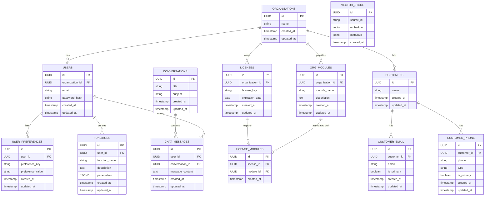

# Supabase Data Model

This document outlines the data model for our application after migrating from a custom backend to Supabase.

## Overview

Our application uses a hierarchical data model with Organizations as the top-level entity. Users, Licenses, and Modules all belong to Organizations, with appropriate relationships between them.

## Tables

<!--
  THIS SECTION IS AUTO-GENERATED FROM THE CURRENT SUPABASE DDL.
  DO NOT EDIT MANUALLY. TO UPDATE, RE-RUN THE DDL EXTRACTION.
-->

### Table: organizations (public)
- **id**: uuid, primary key, default: gen_random_uuid()
- **name**: text, not null
- **created_at**: timestamp with time zone, default: now()
- **updated_at**: timestamp with time zone, default: now()

**Relationships:**
- Referenced by: user_profile.organization_id, licenses.organization_id, customer_organization.organization_id

---

### Table: user_profile (public)
- **id**: uuid, primary key, default: gen_random_uuid()
- **organization_id**: uuid, not null, references organizations(id)
- **role**: text, not null
- **created_at**: timestamp with time zone, default: now()
- **updated_at**: timestamp with time zone, default: now()
- **user_id**: uuid, unique

**Relationships:**
- organization_id → organizations(id)
- user_id → users(id)
- Referenced by: chat_messages.user_id, customer_user.user_id

---

### Table: users (auth)
- **id**: uuid, primary key
- **instance_id**: uuid
- **aud**: character varying
- **role**: character varying
- **email**: character varying
- **encrypted_password**: character varying
- **email_confirmed_at**: timestamp with time zone
- **invited_at**: timestamp with time zone
- **confirmation_token**: character varying
- **confirmation_sent_at**: timestamp with time zone
- **recovery_token**: character varying
- **recovery_sent_at**: timestamp with time zone
- **email_change_token_new**: character varying
- **email_change**: character varying
- **email_change_sent_at**: timestamp with time zone
- **last_sign_in_at**: timestamp with time zone
- **raw_app_meta_data**: jsonb
- **raw_user_meta_data**: jsonb
- **is_super_admin**: boolean
- **created_at**: timestamp with time zone
- **updated_at**: timestamp with time zone
- **phone**: text, unique, default: NULL
- **phone_confirmed_at**: timestamp with time zone
- **phone_change**: text, default: ''
- **phone_change_token**: character varying, default: ''
- **phone_change_sent_at**: timestamp with time zone
- **confirmed_at**: timestamp with time zone, generated: LEAST(email_confirmed_at, phone_confirmed_at)
- **email_change_token_current**: character varying, default: ''
- **email_change_confirm_status**: smallint, default: 0, check: email_change_confirm_status >= 0 AND email_change_confirm_status <= 2
- **banned_until**: timestamp with time zone
- **reauthentication_token**: character varying, default: ''
- **reauthentication_sent_at**: timestamp with time zone
- **is_sso_user**: boolean, not null, default: false
- **deleted_at**: timestamp with time zone
- **is_anonymous**: boolean, not null, default: false

**Relationships:**
- Referenced by: user_profile.user_id, conversations.user_id, user_preferences.user_id, functions.user_id

---

### Table: chat_messages (public)
- **id**: uuid, primary key, default: gen_random_uuid()
- **user_id**: uuid, not null, references user_profile(id)
- **conversation_id**: uuid, not null, references conversations(id)
- **message_content**: text, not null
- **created_at**: timestamp with time zone, default: now()
- **updated_at**: timestamp with time zone, default: now()

**Relationships:**
- user_id → user_profile(id)
- conversation_id → conversations(id)

---

### Table: functions (public)
- **id**: uuid, primary key, default: gen_random_uuid()
- **created_by**: uuid, not null, references users(id)
- **name**: text, not null
- **description**: text
- **created_at**: timestamp with time zone, not null, default: now()
- **updated_at**: timestamp with time zone, default: now()
- **code**: text, not null
- **user_id**: uuid

**Relationships:**
- created_by → users(id)
- user_id → users(id)

---

### Table: licenses (public)
- **id**: uuid, primary key, default: gen_random_uuid()
- **organization_id**: uuid, not null, references organizations(id)
- **license_key**: uuid, unique, default: gen_random_uuid()
- **expiration_date**: timestamp with time zone
- **created_at**: timestamp with time zone, default: now()
- **updated_at**: timestamp with time zone, default: now()

**Relationships:**
- organization_id → organizations(id)
- Referenced by: license_modules.license_id

---

### Table: license_modules (public)
- **id**: uuid, primary key, default: gen_random_uuid()
- **license_id**: uuid, not null, references licenses(id)
- **module_id**: uuid, not null
- **created_at**: timestamp with time zone, default: now()

**Relationships:**
- license_id → licenses(id)

---

### Table: customers (public)
- **id**: uuid, primary key, default: gen_random_uuid()
- **name**: text, not null
- **first_name**: text, not null
- **last_name**: text, not null
- **created_at**: timestamp with time zone, default: now()
- **updated_at**: timestamp with time zone, default: now()

**Relationships:**
- Referenced by: customer_email.customer_id, customer_phone.customer_id, customer_organization.customer_id, customer_user.customer_id

---

### Table: customer_email (public)
- **id**: uuid, primary key, default: gen_random_uuid()
- **customer_id**: uuid, not null, references customers(id)
- **email**: text, not null
- **is_primary**: boolean, default: false
- **created_at**: timestamp with time zone, default: now()
- **updated_at**: timestamp with time zone, default: now()

**Relationships:**
- customer_id → customers(id)

---

### Table: customer_phone (public)
- **id**: uuid, primary key, default: gen_random_uuid()
- **customer_id**: uuid, not null, references customers(id)
- **phone**: text, not null
- **type**: text
- **is_primary**: boolean, default: false
- **created_at**: timestamp with time zone, default: now()
- **updated_at**: timestamp with time zone, default: now()

**Relationships:**
- customer_id → customers(id)

---

### Table: customer_organization (public)
- **id**: uuid, primary key, default: gen_random_uuid()
- **customer_id**: uuid, not null, references customers(id)
- **organization_id**: uuid, not null, references organizations(id)
- **created_at**: timestamp with time zone, default: now()

**Relationships:**
- customer_id → customers(id)
- organization_id → organizations(id)

---

### Table: customer_user (public)
- **id**: uuid, primary key, default: gen_random_uuid()
- **customer_id**: uuid, not null, references customers(id)
- **user_id**: uuid, not null, references user_profile(id)
- **created_at**: timestamp with time zone, default: now()

**Relationships:**
- customer_id → customers(id)
- user_id → user_profile(id)

---

### Table: user_preferences (public)
- **id**: uuid, primary key, default: gen_random_uuid()
- **user_id**: uuid, not null, references users(id)
- **preference_key**: text, not null
- **preference_value**: jsonb
- **created_at**: timestamp with time zone, default: now()
- **updated_at**: timestamp with time zone, default: now()

**Relationships:**
- user_id → users(id)

---

### Table: conversations (public)
- **id**: uuid, primary key, default: gen_random_uuid()
- **title**: text
- **subject**: text
- **created_at**: timestamp with time zone, default: now()
- **updated_at**: timestamp with time zone, default: now()
- **user_id**: uuid, default: gen_random_uuid(), references users(id)

**Relationships:**
- user_id → users(id)
- Referenced by: chat_messages.conversation_id

---

### Table: key_store (public)
- **id**: uuid, primary key, default: gen_random_uuid()
- **user_id**: uuid, not null, references users(id)
- **provider**: text, not null
- **api_key**: text, not null
- **verified**: bool, default: false
- **created_at**: timestamp with time zone, default: now()
- **updated_at**: timestamp with time zone, default: now()

**Relationships:**
- user_id → users(id)

---

### Table: vector_store (public)
- **id**: uuid, primary key, default: gen_random_uuid()
- **user_id**: uuid, not null, references users(id)
- **source_id**: text, not null
- **embedding**: vector(1536)
- **metadata**: jsonb
- **created_at**: timestamp with time zone, default: now()

**Relationships:**
- None

### 12. Conversations

**Purpose:** Groups related chat messages together.

**Fields:**
- `id`: UUID, primary key.
- `title`: string.
- `subject`: string.
- `created_at`: timestamp.
- `updated_at`: timestamp.

**Relationships:**
- Each conversation can have multiple chat messages.

**RLS Recommendations:**
- Enable RLS with policies based on role hierarchy:
   - Developer: Full access to all conversations (FULL CRUD)
   - Admin: Can CRUD all conversations in their organization
   - User: Can CRUD their own conversations
- Example policy:
   ```sql
   -- Developer has full access to everything
   CREATE POLICY "Developers have full access to conversations"
   ON conversations
   USING (auth.jwt() ->> 'role' = 'developer');

   -- Admin can CRUD conversations in their organization
   CREATE POLICY "Admins can manage conversations in their organization"
   ON conversations
   USING (
     auth.jwt() ->> 'role' = 'admin' AND
     id IN (
       SELECT conversation_id FROM chat_messages WHERE user_id IN (
         SELECT id FROM users WHERE organization_id IN (
           SELECT organization_id FROM users WHERE id = auth.uid()
         )
       )
     )
   );

   -- Users can CRUD their own conversations
   CREATE POLICY "Users can manage their own conversations"
   ON conversations
   USING (
     id IN (
       SELECT conversation_id FROM chat_messages WHERE user_id = auth.uid()
     )
   );
   ```
## Data Model Diagram



## Implementation Notes

1. All IDs are true UUIDs, not simple numbers.
2. Supabase Auth will be used for authentication, but we'll maintain a Users table to store additional user information and relationships.
3. The hierarchical structure ensures proper data isolation between organizations.
4. Timestamps are automatically managed by Supabase for created_at and updated_at fields.

## Row Level Security (RLS) Implementation

Row Level Security is a critical feature in Supabase that allows you to control which rows in a table users can access. This section provides general guidelines for implementing RLS across all tables:

1. **Enable RLS on all tables**: By default, tables should have RLS enabled to prevent unauthorized access.

2. **Organization-based isolation**: Most policies should filter data based on the user's organization, ensuring users can only access data within their organization.

3. **Role-based permissions**: Use JWT claims to implement role-based access control:
   - `developer`: Has full access to everything (FULL CRUD)
   - `admin`: Can manage data within their own organization (typically read and update)
   - `user`: Can only access their own data with limited permissions

4. **Common policy patterns**:
   - Self-access: `user_id = auth.uid()`
   - Organization access: `organization_id IN (SELECT organization_id FROM users WHERE id = auth.uid())`
   - Role-based access: `auth.jwt() ->> 'role' = 'admin'`

5. **Separate policies for different operations**:
   - `FOR SELECT`: Controls read access
   - `FOR INSERT`: Controls creation permissions
   - `FOR UPDATE`: Controls modification permissions
   - `FOR DELETE`: Controls deletion permissions

6. **Performance considerations**:
   - Complex RLS policies can impact query performance
   - Consider denormalizing organization_id into child tables for simpler, faster policies
   - Use indexes on columns referenced in RLS policies

7. **Testing RLS policies**:
   - Test policies with different user roles
   - Verify that users cannot access data from other organizations
   - Ensure policies don't have unintended side effects on application functionality