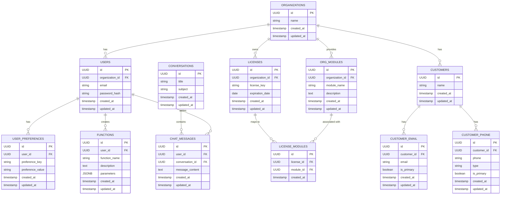

# Supabase Data Model

This document outlines the data model for our application after migrating from a custom backend to Supabase.

## Overview

Our application uses a hierarchical data model with Organizations as the top-level entity. Users, Licenses, and Modules all belong to Organizations, with appropriate relationships between them.

## Tables

### 1. Organizations

**Purpose:** Base entity for licenses, users, and modules.

**Fields:**
- `id`: UUID, primary key.
- `name`: string.
- `created_at`: timestamp.
- `updated_at`: timestamp.

**RLS Recommendations:**
- Enable RLS with policies based on role hierarchy:
  - Developer: Full access to all organizations (FULL CRUD)
  - Admin: Can view and update their own organization
  - User: Can only view their own organization
- Example policy:
  ```sql
  -- Developer has full access to everything
  CREATE POLICY "Developers have full access to organizations"
  ON organizations
  USING (auth.jwt() ->> 'role' = 'developer');
  
  -- Admin can view and update their organization
  CREATE POLICY "Admins can view their organization"
  ON organizations
  FOR SELECT
  USING (auth.uid() IN (
    SELECT id FROM users WHERE organization_id = organizations.id
  ) AND auth.jwt() ->> 'role' = 'admin');
  
  CREATE POLICY "Admins can update their organization"
  ON organizations
  FOR UPDATE
  USING (auth.uid() IN (
    SELECT id FROM users WHERE organization_id = organizations.id
  ) AND auth.jwt() ->> 'role' = 'admin');
  
  -- Users can only view their organization
  CREATE POLICY "Users can view their organization"
  ON organizations
  FOR SELECT
  USING (auth.uid() IN (
    SELECT id FROM users WHERE organization_id = organizations.id
  ));
  ```

### 2. Users

**Purpose:** Represents users, who are children of Organizations.

**Fields:**
- `id`: UUID, primary key.
- `organization_id`: UUID, foreign key referencing Organizations.id.
- `email`: string.
- `password_hash`: string (if applicable; Supabase Auth may manage authentication).
- `created_at`: timestamp.
- `updated_at`: timestamp.

**Relationships:**
- Each user belongs to one Organization.

**RLS Recommendations:**
- Enable RLS with policies based on role hierarchy:
  - Developer: Full access to all users (FULL CRUD)
  - Admin: Can view users in their organization and make them active/inactive
  - User: Can read their own information and update email
- Example policy:
  ```sql
  -- Developer has full access to everything
  CREATE POLICY "Developers have full access to users"
  ON users
  USING (auth.jwt() ->> 'role' = 'developer');
  
  -- Admin can view users in their organization
  CREATE POLICY "Admins can view users in their organization"
  ON users
  FOR SELECT
  USING (
    auth.jwt() ->> 'role' = 'admin' AND
    organization_id IN (
      SELECT organization_id FROM users WHERE id = auth.uid()
    )
  );
  
  -- Admin can update active status of users in their organization
  CREATE POLICY "Admins can update active status"
  ON users
  FOR UPDATE
  USING (
    auth.jwt() ->> 'role' = 'admin' AND
    organization_id IN (
      SELECT organization_id FROM users WHERE id = auth.uid()
    )
  )
  WITH CHECK (
    organization_id IN (
      SELECT organization_id FROM users WHERE id = auth.uid()
    )
  );
  
  -- Users can view their own profile
  CREATE POLICY "Users can view their own profile"
  ON users
  FOR SELECT
  USING (id = auth.uid());
  
  -- Users can update their own email
  CREATE POLICY "Users can update their own email"
  ON users
  FOR UPDATE
  USING (id = auth.uid())
  WITH CHECK (id = auth.uid());
  ```

### 3. Chat Messages

**Purpose:** To support chat functionality (LLMChat component).

**Fields:**
- `id`: UUID, primary key.
- `user_id`: UUID, foreign key referencing Users.id.
- `conversation_id`: UUID, foreign key referencing Conversations.id.
- `message_content`: text.
- `created_at`: timestamp.
- `updated_at`: timestamp.

**Relationships:**
- Each chat message is linked to one user (and indirectly to an Organization via the user).
- Each chat message belongs to one Conversation.

**RLS Recommendations:**
- Enable RLS with policies that allow users to view only messages they created or messages in conversations they have access to.
- Example policy:
  ```sql
  CREATE POLICY "Users can view their own messages"
  ON chat_messages
  FOR SELECT
  USING (
    user_id = auth.uid() OR
    conversation_id IN (
      SELECT id FROM conversations WHERE id IN (
        SELECT conversation_id FROM chat_messages WHERE user_id = auth.uid()
      )
    )
  );
  
  CREATE POLICY "Users can create their own messages"
  ON chat_messages
  FOR INSERT
  WITH CHECK (user_id = auth.uid());
  
  CREATE POLICY "Users can update their own messages"
  ON chat_messages
  FOR UPDATE
  USING (user_id = auth.uid());
  ```

### 4. Functions

**Purpose:** Stores function metadata.

**Fields:**
- `id`: UUID, primary key.
- `user_id`: UUID, foreign key referencing Users.id.
- `function_name`: string.
- `description`: text.
- `parameters`: JSONB field (metadata about parameters).
- `created_at`: timestamp.
- `updated_at`: timestamp.

**Relationships:**
- Each function is linked to a user (and indirectly through that to an Organization).

**RLS Recommendations:**
- Enable RLS with policies based on role hierarchy:
  - Developer: Full access to all functions (FULL CRUD)
  - User: Can CRUD their own functions
  - Public: Can read all functions
- Example policy:
  ```sql
  -- Developer has full access to everything
  CREATE POLICY "Developers have full access to functions"
  ON functions
  USING (auth.jwt() ->> 'role' = 'developer');
  
  -- Users can CRUD their own functions
  CREATE POLICY "Users can manage their own functions"
  ON functions
  USING (user_id = auth.uid());
  
  -- Public can read all functions
  CREATE POLICY "Public can read all functions"
  ON functions
  FOR SELECT
  USING (true);
  ```

### 5. Licenses

**Purpose:** Manages license keys and expiration details.

**Fields:**
- `id`: UUID, primary key.
- `organization_id`: UUID, foreign key referencing Organizations.id.
- `license_key`: string.
- `expiration_date`: date or timestamp.
- `created_at`: timestamp.
- `updated_at`: timestamp.

**Relationships:**
- Each license is associated with an Organization.

**RLS Recommendations:**
- Enable RLS with policies based on role hierarchy:
  - Developer: Full access to all licenses (FULL CRUD)
  - Admin: Can read licenses for their organization
  - User: No access
- Example policy:
  ```sql
  -- Developer has full access to everything
  CREATE POLICY "Developers have full access to licenses"
  ON licenses
  USING (auth.jwt() ->> 'role' = 'developer');
  
  -- Admin can read licenses for their organization
  CREATE POLICY "Admins can read licenses for their organization"
  ON licenses
  FOR SELECT
  USING (
    auth.jwt() ->> 'role' = 'admin' AND
    organization_id IN (
      SELECT organization_id FROM users WHERE id = auth.uid()
    )
  );
  ```

### 6. Organization_Modules

**Purpose:** Stores modules that belong to an organization.

**Fields:**
- `id`: UUID, primary key.
- `organization_id`: UUID, foreign key referencing Organizations.id.
- `module_name`: string.
- `description`: text.
- `created_at`: timestamp.
- `updated_at`: timestamp.

**Relationships:**
- Each module is directly a child of an Organization.

**RLS Recommendations:**
- Enable RLS with policies based on role hierarchy:
  - Developer: Full access to all modules (FULL CRUD)
  - Admin: Can read modules for their organization
  - User: No access
- Example policy:
  ```sql
  -- Developer has full access to everything
  CREATE POLICY "Developers have full access to organization modules"
  ON organization_modules
  USING (auth.jwt() ->> 'role' = 'developer');
  
  -- Admin can read modules for their organization
  CREATE POLICY "Admins can read modules for their organization"
  ON organization_modules
  FOR SELECT
  USING (
    auth.jwt() ->> 'role' = 'admin' AND
    organization_id IN (
      SELECT organization_id FROM users WHERE id = auth.uid()
    )
  );
  ```

### 7. License_Modules

**Purpose:** Many-to-many association between Licenses and Organization_Modules. This table must strictly link licenses to modules that are assigned to their respective organizations.

**Fields:**
- `id`: UUID, primary key.
- `license_id`: UUID, foreign key referencing Licenses.id.
- `module_id`: UUID, foreign key referencing Organization_Modules.id.
- `created_at`: timestamp.

**Notes:**
- Application logic (or database constraints/triggers) should ensure that the module in License_Modules is indeed a module from the associated Organization_Modules for that license.

**RLS Recommendations:**
- Enable RLS with policies based on role hierarchy:
  - Developer: Full access to all license modules (FULL CRUD)
  - Admin: Can read license modules for their organization
  - User: No access
- Example policy:
  ```sql
  -- Developer has full access to everything
  CREATE POLICY "Developers have full access to license modules"
  ON license_modules
  USING (auth.jwt() ->> 'role' = 'developer');
  
  -- Admin can read license modules for their organization
  CREATE POLICY "Admins can read license modules for their organization"
  ON license_modules
  FOR SELECT
  USING (
    auth.jwt() ->> 'role' = 'admin' AND
    license_id IN (
      SELECT id FROM licenses WHERE organization_id IN (
        SELECT organization_id FROM users WHERE id = auth.uid()
      )
    )
  );
  ```

### 8. Customers

**Purpose:** Represents customers of the organization.

**Fields:**
- `id`: UUID, primary key.
- `name`: string.
- `created_at`: timestamp.
- `updated_at`: timestamp.

**Relationships:**
- Customers can have multiple email addresses and phone numbers.

**RLS Recommendations:**
- Enable RLS with policies based on role hierarchy:
  - Developer: Full access to all customers (FULL CRUD)
  - Admin: Can CRUD all customers in their organization
  - User: Can CRUD their own customers
- Example policy:
  ```sql
  -- Developer has full access to everything
  CREATE POLICY "Developers have full access to customers"
  ON customers
  USING (auth.jwt() ->> 'role' = 'developer');
  
  -- Admin can CRUD customers in their organization
  CREATE POLICY "Admins can manage customers in their organization"
  ON customers
  USING (
    auth.jwt() ->> 'role' = 'admin' AND
    id IN (
      SELECT customer_id FROM customer_organization WHERE organization_id IN (
        SELECT organization_id FROM users WHERE id = auth.uid()
      )
    )
  );
  
  -- Users can CRUD their own customers
  CREATE POLICY "Users can manage their own customers"
  ON customers
  USING (
    id IN (
      SELECT customer_id FROM customer_user WHERE user_id = auth.uid()
    )
  );
  ```
  
  Note: This assumes customer_organization and customer_user junction tables. If customers are directly linked to organizations or users, adjust the policy accordingly.

### 9. Customer_Email

**Purpose:** Stores email addresses for customers.

**Fields:**
- `id`: UUID, primary key.
- `customer_id`: UUID, foreign key referencing Customers.id.
- `email`: string.
- `is_primary`: boolean.
- `created_at`: timestamp.
- `updated_at`: timestamp.

**Relationships:**
- Each email address belongs to one Customer.

**RLS Recommendations:**
- Enable RLS with policies based on role hierarchy:
  - Developer: Full access to all customer emails (FULL CRUD)
  - Admin: Can CRUD all customer emails in their organization
  - User: Can CRUD emails for their own customers
- Example policy:
  ```sql
  -- Developer has full access to everything
  CREATE POLICY "Developers have full access to customer emails"
  ON customer_email
  USING (auth.jwt() ->> 'role' = 'developer');
  
  -- Admin can CRUD customer emails in their organization
  CREATE POLICY "Admins can manage customer emails in their organization"
  ON customer_email
  USING (
    auth.jwt() ->> 'role' = 'admin' AND
    customer_id IN (
      SELECT id FROM customers WHERE id IN (
        SELECT customer_id FROM customer_organization WHERE organization_id IN (
          SELECT organization_id FROM users WHERE id = auth.uid()
        )
      )
    )
  );
  
  -- Users can CRUD emails for their own customers
  CREATE POLICY "Users can manage emails for their own customers"
  ON customer_email
  USING (
    customer_id IN (
      SELECT id FROM customers WHERE id IN (
        SELECT customer_id FROM customer_user WHERE user_id = auth.uid()
      )
    )
  );
  ```

### 10. Customer_Phone

**Purpose:** Stores phone numbers for customers.

**Fields:**
- `id`: UUID, primary key.
- `customer_id`: UUID, foreign key referencing Customers.id.
- `phone`: string.
- `type`: string (e.g., mobile, home, work).
- `is_primary`: boolean.
- `created_at`: timestamp.
- `updated_at`: timestamp.

**Relationships:**
- Each phone number belongs to one Customer.

**RLS Recommendations:**
- Enable RLS with policies based on role hierarchy:
  - Developer: Full access to all customer phones (FULL CRUD)
  - Admin: Can CRUD all customer phones in their organization
  - User: Can CRUD phones for their own customers
- Example policy:
  ```sql
  -- Developer has full access to everything
  CREATE POLICY "Developers have full access to customer phones"
  ON customer_phone
  USING (auth.jwt() ->> 'role' = 'developer');
  
  -- Admin can CRUD customer phones in their organization
  CREATE POLICY "Admins can manage customer phones in their organization"
  ON customer_phone
  USING (
    auth.jwt() ->> 'role' = 'admin' AND
    customer_id IN (
      SELECT id FROM customers WHERE id IN (
        SELECT customer_id FROM customer_organization WHERE organization_id IN (
          SELECT organization_id FROM users WHERE id = auth.uid()
        )
      )
    )
  );
  
  -- Users can CRUD phones for their own customers
  CREATE POLICY "Users can manage phones for their own customers"
  ON customer_phone
  USING (
    customer_id IN (
      SELECT id FROM customers WHERE id IN (
        SELECT customer_id FROM customer_user WHERE user_id = auth.uid()
      )
    )
  );
  ```

### 11. User_Preferences

**Purpose:** Stores user preferences.

**Fields:**
- `id`: UUID, primary key.
- `user_id`: UUID, foreign key referencing Users.id.
- `preference_key`: string.
- `preference_value`: string or JSONB.
- `created_at`: timestamp.
- `updated_at`: timestamp.

**Relationships:**
- Each preference belongs to one User.

**RLS Recommendations:**
- Enable RLS with policies based on role hierarchy:
  - Developer: Full access to all user preferences (FULL CRUD)
  - Admin: Can CRUD all preferences in their organization
  - User: Can CRUD their own preferences
- Example policy:
  ```sql
  -- Developer has full access to everything
  CREATE POLICY "Developers have full access to user preferences"
  ON user_preferences
  USING (auth.jwt() ->> 'role' = 'developer');
  
  -- Admin can CRUD preferences in their organization
  CREATE POLICY "Admins can manage preferences in their organization"
  ON user_preferences
  USING (
    auth.jwt() ->> 'role' = 'admin' AND
    user_id IN (
      SELECT id FROM users WHERE organization_id IN (
        SELECT organization_id FROM users WHERE id = auth.uid()
      )
    )
  );
  
  -- Users can CRUD their own preferences
  CREATE POLICY "Users can manage their own preferences"
  ON user_preferences
  USING (user_id = auth.uid());
  ```

### 12. Conversations

**Purpose:** Groups related chat messages together.

**Fields:**
- `id`: UUID, primary key.
- `title`: string.
- `subject`: string.
- `created_at`: timestamp.
- `updated_at`: timestamp.

**Relationships:**
- Each conversation can have multiple chat messages.

**RLS Recommendations:**
- Enable RLS with policies based on role hierarchy:
  - Developer: Full access to all conversations (FULL CRUD)
  - Admin: Can CRUD all conversations in their organization
  - User: Can CRUD their own conversations
- Example policy:
  ```sql
  -- Developer has full access to everything
  CREATE POLICY "Developers have full access to conversations"
  ON conversations
  USING (auth.jwt() ->> 'role' = 'developer');
  
  -- Admin can CRUD conversations in their organization
  CREATE POLICY "Admins can manage conversations in their organization"
  ON conversations
  USING (
    auth.jwt() ->> 'role' = 'admin' AND
    id IN (
      SELECT conversation_id FROM chat_messages WHERE user_id IN (
        SELECT id FROM users WHERE organization_id IN (
          SELECT organization_id FROM users WHERE id = auth.uid()
        )
      )
    )
  );
  
  -- Users can CRUD their own conversations
  CREATE POLICY "Users can manage their own conversations"
  ON conversations
  USING (
    id IN (
      SELECT conversation_id FROM chat_messages WHERE user_id = auth.uid()
    )
  );
  ```

## Data Model Diagram



## Implementation Notes

1. All IDs are true UUIDs, not simple numbers.
2. Supabase Auth will be used for authentication, but we'll maintain a Users table to store additional user information and relationships.
3. The hierarchical structure ensures proper data isolation between organizations.
4. Timestamps are automatically managed by Supabase for created_at and updated_at fields.

## Row Level Security (RLS) Implementation

Row Level Security is a critical feature in Supabase that allows you to control which rows in a table users can access. This section provides general guidelines for implementing RLS across all tables:

1. **Enable RLS on all tables**: By default, tables should have RLS enabled to prevent unauthorized access.

2. **Organization-based isolation**: Most policies should filter data based on the user's organization, ensuring users can only access data within their organization.

3. **Role-based permissions**: Use JWT claims to implement role-based access control:
   - `developer`: Has full access to everything (FULL CRUD)
   - `admin`: Can manage data within their own organization (typically read and update)
   - `user`: Can only access their own data with limited permissions

4. **Common policy patterns**:
   - Self-access: `user_id = auth.uid()`
   - Organization access: `organization_id IN (SELECT organization_id FROM users WHERE id = auth.uid())`
   - Role-based access: `auth.jwt() ->> 'role' = 'admin'`

5. **Separate policies for different operations**:
   - `FOR SELECT`: Controls read access
   - `FOR INSERT`: Controls creation permissions
   - `FOR UPDATE`: Controls modification permissions
   - `FOR DELETE`: Controls deletion permissions

6. **Performance considerations**:
   - Complex RLS policies can impact query performance
   - Consider denormalizing organization_id into child tables for simpler, faster policies
   - Use indexes on columns referenced in RLS policies

7. **Testing RLS policies**:
   - Test policies with different user roles
   - Verify that users cannot access data from other organizations
   - Ensure policies don't have unintended side effects on application functionality