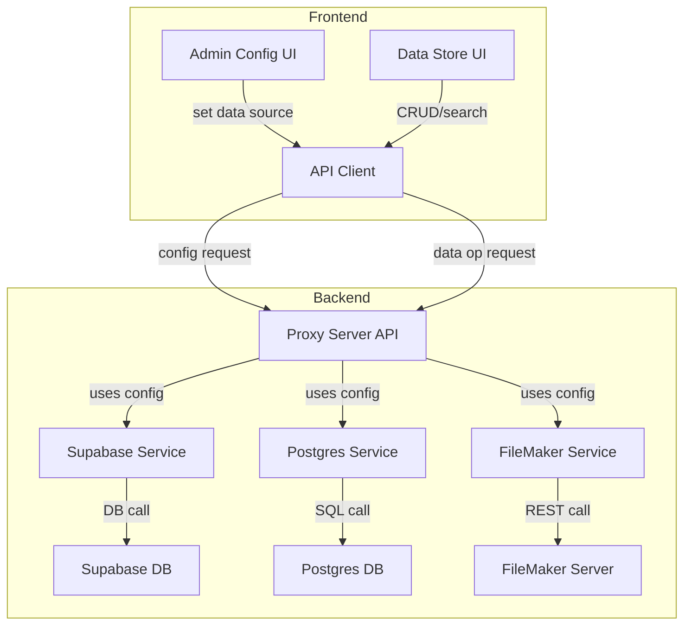

# Data Store Component: Design Plan

## Objective
Create a Data Store component that can create, read, update, delete, and search vector records in one of three database sources (local POSTGRES, Supabase, FileMaker), all accessible via URL. The Data Store will have both backend and frontend components.

---

## Vector Record Schema

| Field       | Type         | Description                |
|-------------|--------------|----------------------------|
| id          | uuid         | Unique identifier          |
| source_id   | uuid or text | Identifier for data source |
| embedding   | float[]      | Vector embedding           |
| metadata    | jsonb/object | Arbitrary metadata         |
| created_at  | timestamp    | Creation time              |

---

## Supported Operations
- **Create**: Insert a new vector record.
- **Read**: Retrieve a vector record by id.
- **Update**: Modify an existing vector record.
- **Delete**: Remove a vector record.
- **Search**: Find records by vector similarity and/or metadata, optionally filtered by source_id.

---

## Database Source Abstraction
- **Supabase**: Use existing service/client with pgvector support.
- **Local POSTGRES**: Connect via SQLAlchemy/psycopg2 (Python backend), using pgvector for vector search.
- **FileMaker**: Access via REST API; vector similarity search performed in application layer due to lack of native support.

All sources are selected/configured via URL and can specify table name and field schema.

---

## Design Considerations

- **Single Table vs Multiple Tables**:  
  - Prefer a single table with a `source_id` field to identify the data source for each vector record.  
  - This simplifies querying and management if schemas are consistent.  
  - Multiple tables per source can be used if schemas differ significantly or isolation is required.

- **Semantic Search in FileMaker**:  
  - Since FileMaker lacks native vector search, fetch candidate records via REST API and perform vector similarity calculations in the backend application.  
  - Use metadata filters to reduce candidate set before similarity calculation.

- **Security**:  
  - Enforce admin-only access for configuration changes.  
  - Securely handle credentials and URLs.

- **Extensibility**:  
  - New data sources can be added by implementing the backend interface and updating routing logic.

---

## Data Flow Diagram (Mermaid)

---

## Summary

- Use a single table with a `source_id` field to store vector embeddings from multiple sources when possible.
- For FileMaker, perform semantic search by fetching records and computing vector similarity in the application layer.
- Support configuration of table name and field schema per data source.
- Ensure consistent API and UI for all data sources.