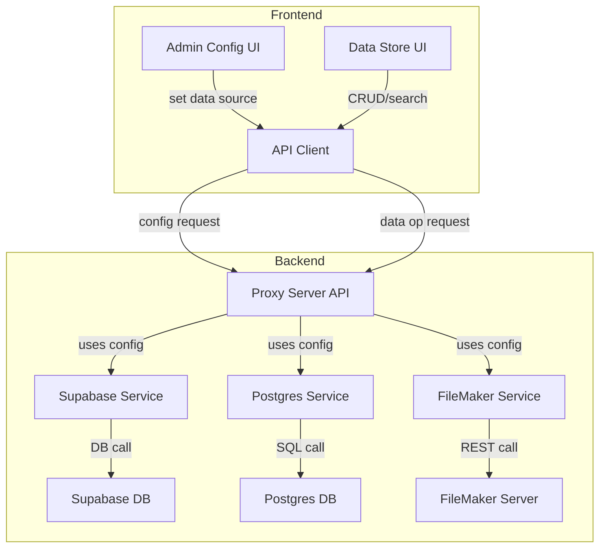

# Data Store Component: Design Plan

## Objective
Create a Data Store component that can create, read, update, delete, and search vector records in one of three database sources (local POSTGRES, Supabase, FileMaker), all accessible via URL. The Data Store will have both backend and frontend components.

---

## Vector Record Schema

| Field       | Type         | Description                |
|-------------|--------------|----------------------------|
| id          | uuid         | Unique identifier          |
| embedding   | float[]      | Vector embedding           |
| metadata    | jsonb/object | Arbitrary metadata         |
| created_at  | timestamp    | Creation time              |

---

## Supported Operations
- **Create**: Insert a new vector record.
- **Read**: Retrieve a vector record by id.
- **Update**: Modify an existing vector record.
- **Delete**: Remove a vector record.
- **Search**: Find records by vector similarity and/or metadata.

---

## Database Source Abstraction
- **Supabase**: Use existing service/client.
- **Local POSTGRES**: Connect via SQLAlchemy/psycopg2 (Python backend).
- **FileMaker**: Access via REST API.

All sources are selected/configured via URL.

---

## Architecture Overview

### Frontend

- **Data Store Config UI:** Allows user to select and set data source(s) including type (FileMaker, POSTGRESS, Supabase), location (url) and credentials (stored in data_store_credentials table). Use can denote default store. This extendes and is displayed as part of the setting component.
- **Data Store UI:** Allows all users to perform CRUD/search operations, always using the default data source.
- Integrate with Redux or local state for configuration and results.
- Reuse patterns from Tools UI (modular, form-driven).
- Display the current data source and status to users.

### Backend

- Exposes endpoints for:
  - Setting/changing the data source (admin-only).
  - Performing CRUD/search operations on vector records.
- Maintains the current data source configuration (in memory, file, or database).
- Routes all data operations to the correct service based on the current configuration.
- Extend `llm_proxy_server.py` (or similar) to:
  - Route Data Store API calls to the correct backend (Supabase, POSTGRES, FileMaker) based on config.
  - Implement CRUD/search logic for each backend.
  - Abstract vector record operations behind a unified API.
- Add support for:
  - Local POSTGRES: direct DB connection.
  - FileMaker: REST API calls.
  - Supabase: use existing service/client.
- Enforce admin-only access for configuration changes.
---

## Data Flow Diagram (Mermaid)

---

## Implementation Steps

### Backend

1. Implement a configuration endpoint (e.g., `POST /datastore/config`) for setting the data source (admin-only).
2. Store the current data source configuration securely (in memory, file, or DB).
3. Implement unified CRUD/search endpoints (e.g., `POST /datastore/records`, `GET /datastore/records/:id`).
4. Route all data operations to the correct service based on the stored configuration.
5. Enforce admin-only access for configuration changes.

### Frontend

1. Create an admin-only configuration UI for selecting the data source.
2. Create the Data Store UI for CRUD/search operations.
3. Integrate both UIs with the backend API.
4. Display the current data source and status to users (read-only for non-admins).

### Testing

- [ ] Unit and integration tests for backend logic.
- [ ] UI tests for frontend.

---

## Key Design Considerations

- **Extensibility:** New data sources can be added by implementing the backend interface and updating the routing logic.
- **Security:** Only admins can change the data source configuration. Ensure safe handling of credentials/URLs, especially for FileMaker and POSTGRES.
- **Consistency:** All users interact with the same data source until changed by an admin.
- **Error Handling:** Unified error reporting for both configuration and data operations in frontend and backend.
- **Performance:** Vector search may require specialized indexing (e.g., pgvector for POSTGRES).

---

### Open Questions / Assumptions

- FileMaker REST API endpoints and authentication details will be provided/configured.
- Vector search implementation (e.g., cosine similarity) will be supported in all backends, or gracefully degraded if not.