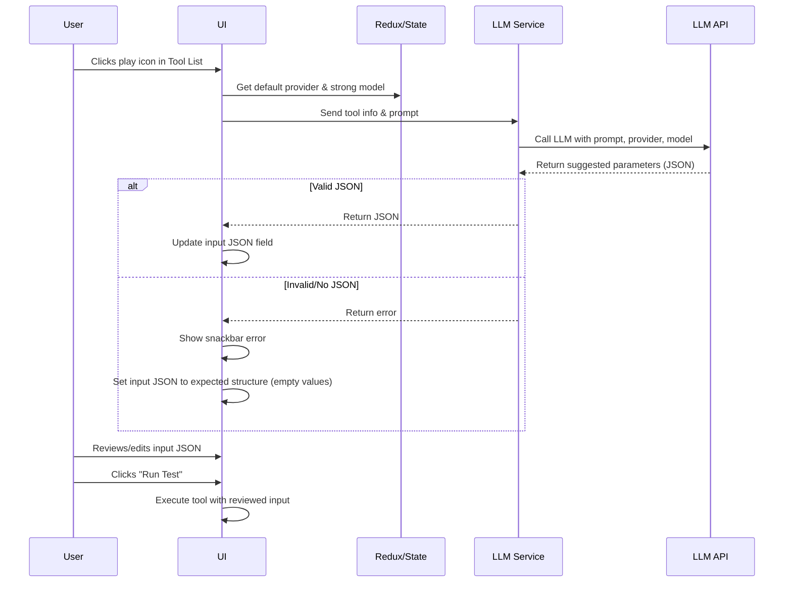

# LLM-Powered Input Generation for Tool Playground

## Objective

Enable users to generate input parameters for tools in the Tool Playground using an LLM (Large Language Model), with a "human in the loop" review step before execution.

---

## Implementation Plan

### 1. Provider and Model Selection
- Use the state object (Redux) (see state_object.md) to determine the user's default LLM provider and their configured "strong" chat model.

### 2. UI/UX Changes
- When the user clicks the play icon in the Tool List, the Tool Playground opens.
- As soon as the Tool Playground opens, the system will:
  - Call the LLM with a prompt containing the tool's metadata and a request to generate input parameters.
  - Render the resulting parameters from the LLM into the input JSON field for the user to review and edit.
- The tool will **not** be executed automatically. The user will review the generated input and then manually click **"Run Test"** to execute the tool.

### 3. Prompt Engineering
- The prompt sent to the LLM should include:
  - Tool name, description, and parameter schema (if available).
  - Clear instruction: “Suggest a valid JSON input object for this tool.”

### 4. Service Layer
- Add a function in the LLM service or redux slice to:
  - Accept a prompt, provider, and model.
  - Call the appropriate LLM API endpoint.
  - Return the LLM’s response.

### 5. Error Handling
- If the LLM call fails or returns invalid JSON:
  - Show a snackbar: “Could not generate input from LLM. Please enter parameters manually.”
  - Set the input JSON to the tool’s expected parameter structure (with empty values for each key).

---

## Sequence Diagram

---

## Key Points

- **Provider/Model:** Always use the user's default provider and strong chat model from state.
- **Prompt/Response:** Expect the LLM to return a JSON object. If not, fallback gracefully.
- **User Experience:** The user can always edit the input JSON if the LLM suggestion is not suitable.
- **Error Handling:** Non-blocking; user can always proceed manually.

---