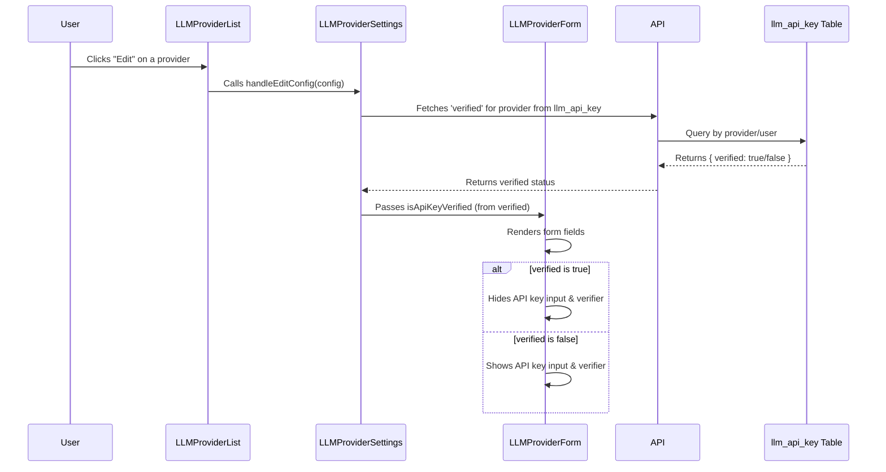

# LLM Provider Repair Plan

## Objective
- When editing an LLM Provider configuration, the form should:
  1. Render the existing state into the correct input fields.
  2. On mount, check the `llm_api_key` table via an API/database call to confirm if the API key is valid by reading the `verified` field.
  3. If `verified` is true, the API key input and verifier component should **not** render.

---

## Current State (Summary of Findings)
- The form currently sets `isApiKeyVerified` to true if an API key is present (or if the provider is Ollama), not by checking the `verified` field in the database.
- The API key input and verifier UI are hidden if `isApiKeyVerified` is true.
- There is **no explicit check** of the `verified` field in the `llm_api_key` table/config on mount.

---

## Required Changes

### 1. On Mount: Check API Key Verification Status
- When the form is opened for editing, trigger an API/database call to fetch the `verified` status for the selected provider from the `llm_api_key` table.
- Use this value to set `isApiKeyVerified`.

### 2. Conditional Rendering
- Only hide the API key input and verifier UI if `verified` is true (not just if an API key is present).

### 3. Populate Form Fields
- Continue to populate the form fields with the selected provider's configuration as currently implemented.

### 4. Update State Management
- Ensure that the result of the API/database call updates the `isApiKeyVerified` state in the parent component (`LLMProviderSettings.jsx`).

### 5. Error Handling
- If the API/database call fails, show an appropriate error and default to showing the API key input and verifier.

---

## Proposed Flow (Mermaid Diagram)

---

## Implementation Steps

1. **Add API/database call in `handleEditConfig` or useEffect in `LLMProviderSettings.jsx` to fetch the `verified` field for the selected provider.**
   - Use the provider/user info to query the `llm_api_key` table.
   - Update `isApiKeyVerified` based on the result.

2. **Update the logic in `LLMProviderForm` to only hide the API key input and verifier if `isApiKeyVerified` is true.**
   - No changes needed here if the prop is set correctly.

3. **Ensure error handling is robust.**
   - If the API/database call fails, default to showing the API key input and verifier, and display an error message.

4. **Test the flow:**
   - Edit a provider with a verified API key: API key input and verifier should be hidden.
   - Edit a provider with an unverified API key: API key input and verifier should be shown.
   - Edit a provider with no API key: API key input and verifier should be shown.

---