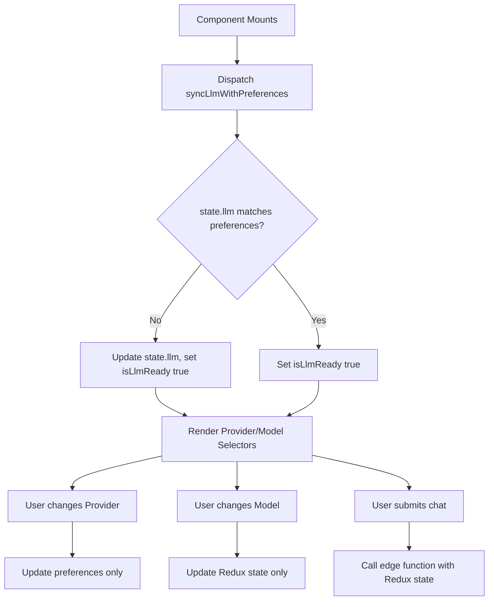

# LLMChat Refactor: Detailed Step-by-Step Plan

## 1. State Sync on Mount

**Goal:** Ensure Redux state.llm is always in sync with user preferences on component mount, and set an `isLlmReady` flag when done.

**Steps:**
- [ ] In `llmSlice.js`, implement a thunk called `syncLlmWithPreferences`:
  - Compares all relevant fields between `state.llm` and `state.auth.user.preferences`.
  - If differences exist, update `state.llm` to match preferences.
  - Set `isLlmReady` to `true` after sync (regardless of whether an update was needed).
- [ ] In `LLMChat.jsx`, on mount, dispatch `syncLlmWithPreferences`.
- [ ] Remove any direct calls to `updateState(llmPreferences)` on mount.

---

## 2. UI Gating with isLlmReady

**Goal:** Prevent UI from rendering provider/model selectors until state.llm is synced, avoiding MUI errors.

**Steps:**
- [ ] Add `isLlmReady` to Redux state in `llmSlice.js`.
- [ ] In `LLMChat.jsx`, use `isLlmReady` from Redux to conditionally render:
  - If `isLlmReady` is `false`, show a loading spinner or placeholder.
  - Only render provider/model selectors and chat UI when `isLlmReady` is `true`.

---

## 3. Provider/Model Selectors: Redux-Only, No Local State

**Goal:** Provider/model selectors are fully controlled by Redux, not local state.

**Steps:**
- [ ] Remove all local state for `selectedProvider`, `selectedModel`, and `providerModels` in `LLMChat.jsx`.
- [ ] Use Redux selectors to get:
  - Provider options: from `state.auth.user.preferences.llm_providers[*].provider`.
  - Model options: for the selected provider, use its `defaultModelWeak` and `defaultModelStrong` from preferences.
  - Active provider: from `llmPreferences.defaultProvider`.
  - Active model: from `llmPreferences.defaultModelWeak`.
- [ ] Ensure the selectors are derived from Redux only, not from local state or useEffect.

---

## 4. Change Handlers: Preferences vs. State

**Goal:** Clean separation of what updates preferences vs. what updates state.llm.

**Steps:**
- [ ] On provider change:
  - Dispatch an action to update user preferences (not state.llm).
  - Do **not** reset state.llm directly.
- [ ] On model change:
  - Update only the Redux state for the model (not user preferences).
- [ ] Remove any local state updates for provider/model selection.

---

## 5. Edge Function Calls: Use Redux State

**Goal:** Always use the current Redux state for provider, model, and other fields when calling the edge function.

**Steps:**
- [ ] In the chat submit handler, get provider, model, and other relevant fields from Redux state, not from local state.
- [ ] Remove any code that references local state for these values.

---

## 6. Implementation Steps by File

### a. `src/redux/slices/llmSlice.js`
- [ ] Add `isLlmReady` to initial state.
- [ ] Implement `syncLlmWithPreferences` thunk as described above.
- [ ] Add selectors for:
  - Provider options
  - Model options for selected provider
  - Active provider/model
  - isLlmReady

### b. `src/components/Chat/LLMChat.jsx`
- [ ] On mount, dispatch `syncLlmWithPreferences`.
- [ ] Use `isLlmReady` to gate rendering.
- [ ] Use Redux selectors for all provider/model options and values.
- [ ] Remove all local state for provider/model and related useEffects.
- [ ] On provider/model change, dispatch appropriate Redux actions as per the new flow.
- [ ] On submit, use Redux state for edge function payload.

---

## 7. Mermaid Diagram

---

## 8. Summary Table of Required Changes

| Area                | Current State (LLMChat.jsx)         | Required Refactor Action                |
|---------------------|-------------------------------------|-----------------------------------------|
| State Sync          | useEffect with updateState          | Use thunk syncLlmWithPreferences        |
| UI Gating           | No gating, always renders           | Gate with isLlmReady                    |
| Provider/Model      | Local state + Redux                 | Redux-only, no local state              |
| Change Handlers     | Mix of local and Redux updates      | Provider: update preferences only; Model: update Redux only |
| Edge Function Call  | Uses local state                    | Use Redux state only                    |

---

## 9. Additional Notes

- Remove all useState/useEffect logic related to provider/model selection in LLMChat.jsx.
- All provider/model logic should be derived from Redux selectors.
- Ensure that the Redux slice is the single source of truth for LLM state.