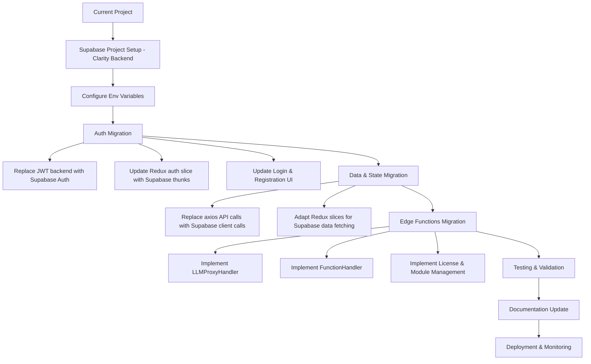

# Supabase Migration Plan

## Migration Plan Details

1. Supabase Project Setup - Clarity Backend
   - Supabase project "Clarity Backend" has been created.
   - Configure database schema including Users, chat_messages, licenses, modules tables.
   - Obtain Supabase URL and anon key.
   - Add these to the .env file as VITE_SUPABASE_URL and VITE_SUPABASE_ANON_KEY.

2. Authentication Migration
   - Replace existing JWT backend auth with Supabase Auth.
   - Use the existing Redux auth slice with Supabase async thunks (signInWithEmail, signUpWithEmail, signOut, getSession).
   - Update LoginForm and RegistrationForm components to use Redux thunks.
   - Remove or refactor axios token management related to JWT.

3. Data Fetching and State Management Migration
   - Replace axios API calls with Supabase client calls for CRUD operations.
   - Adapt Redux slices to use Supabase queries and subscriptions where applicable.
   - Implement realtime subscriptions for live updates if needed.

4. API Calls and Axios Replacement
   - Remove axios interceptors for token refresh.
   - Use Supabase client for all authenticated requests.
   - Refactor any custom API calls to Supabase edge functions or direct DB calls.

5. Edge Functions Migration
   - Implement required edge functions in Supabase for:
     - LLMProxyHandler: secure proxy to LLM providers.
     - FunctionHandler: manage user-defined functions.
     - License validation and module management.
   - Ensure security, rate limiting, and input validation in edge functions.

6. Testing and Validation
   - Test auth flows end-to-end.
   - Test data fetching, mutations, and realtime updates.
   - Test edge functions with expected inputs and error cases.

7. Documentation Update
   - Update docs/migration_supabase_tasks.md with this plan.
   - Update Auth_Implementation_Guide.md and reduxImplementationPlan.md as needed.
   - Document edge functions in docs/edge_functions.md.

Please review this plan and let me know if you would like to make any changes or additions before implementation.