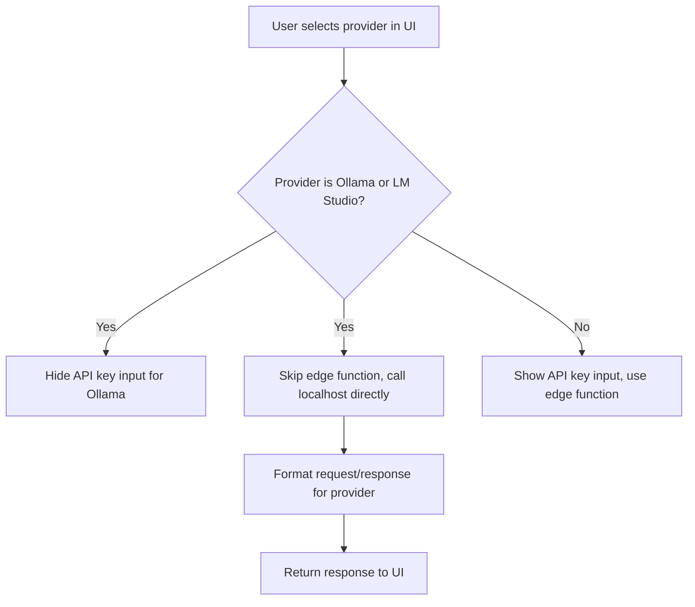

# Minimal Integration Plan: Local LLMs (Ollama & LM Studio)

## Objective

Enable seamless, minimal-complexity integration of local LLMs (Ollama and LM Studio) so that all local calls are routed directly from the browser to localhost, with no unnecessary backend or edge function involvement.

---

## 1. Current State

- **ProviderSelector**: Already lists "Ollama" and "LM Studio".
- **providerEndpoints.js**: Endpoints and headers for both are defined.
- **llmProviderService.js**: No special handling for local LLMs; always expects an API key and uses a Supabase edge function for model verification.
- **ToolChat.jsx**: Sends chat requests to a backend API, not directly to the LLM provider.

---

## 2. Minimal Integration Plan

### A. Allow No API Key for Ollama/LM Studio
- Update UI and service logic so that Ollama (and optionally LM Studio) do not require an API key for configuration or verification.

### B. Request/Response Handling
- Ensure the browser (frontend) can:
  - Route requests to the correct local endpoint (Ollama or LM Studio) based on user/provider selection.
  - Format requests and parse responses according to each provider’s API spec.
    - **Ollama**: `POST /api/chat` with `{ model, messages }`, response is `{ message: { content } }`.
    - **LM Studio**: OpenAI-compatible, and likely requires an API key.

### C. UI/UX
- When Ollama or LM Studio is selected:
  - Hide or disable the API key input for Ollama.
  - Skip API key verification for both Ollama but include it for LM Studio.
  - Allow saving the provider config without an API key for Ollama.

### D. Service Layer
- In `llmProviderService.js`, for both Ollama and LM Studio, model verification and chat requests should be made directly from the browser to the local endpoint (as defined in `providerEndpoints.js`), bypassing the Supabase edge function entirely.
  - For Ollama: Do not require or use an API key.
  - For LM Studio: Use the API key if provided, but still call the local endpoint directly from the browser.

### E. Other Providers
- For all other providers, continue using the current edge function logic for model verification and chat.

---

## 3. Implementation Steps

---

## 4. Summary Table of Required Changes

| Area                        | Change Needed? | Description                                                                 |
|-----------------------------|:-------------:|----------------------------------------------------------------------------|
| ProviderSelector UI         |   Minor       | Ensure Ollama/LM Studio can be selected                                    |
| Provider Config Form        |   Minor       | Hide/disable API key for Ollama                                            |
| llmProviderService.js       |   Minor       | Skip API key verification and edge function for Ollama/LM Studio           |
| providerEndpoints.js        |   None        | Already correct                                                            |
| Backend `/api/chat` route   |   None        | Not used for local LLMs                                                    |
| ToolChat.jsx                |   None        | No change unless direct provider calls are needed                          |

---

## 5. Notes

- For Ollama: No API key, never use the edge function, always call localhost directly from the browser.
- For LM Studio: Use API key if provided, but never use the edge function, always call localhost directly from the browser.
- For other providers: No change to current logic.

---

## 6. Next Steps

1. Update `llmProviderService.js` as described.
2. Adjust UI logic for API key input as needed.
3. Test with both Ollama and LM Studio running locally to confirm seamless integration.