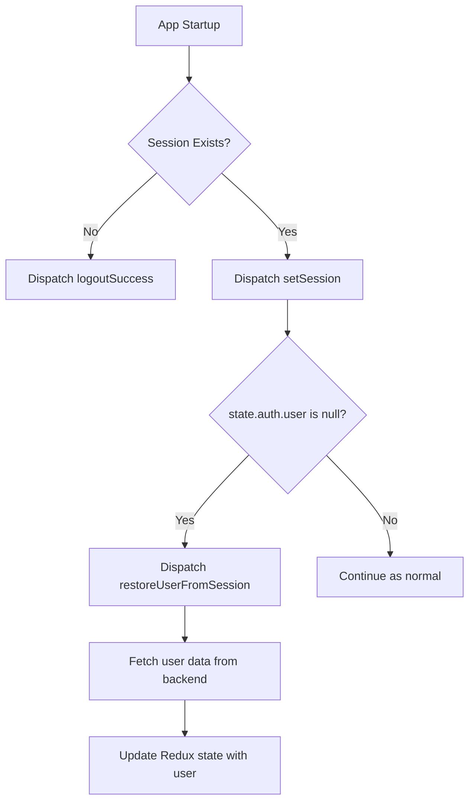

# Plan: Restore State on Session Restore

## Objective

Ensure that when the app refreshes and a session is restored, the full user state (profile, preferences, etc.) is also restored in Redux, with minimal codebase impact.

---

## Approach

### 1. Create a New Thunk: `restoreUserFromSession`

- **Location:** `src/redux/slices/authSlice.js`
- **Purpose:** Fetch user data (profile, preferences, etc.) using the current session's user info, without re-authenticating.
- **How:** 
  - Accepts no arguments (or optionally the session object).
  - Gets the current session from Redux state or Supabase.
  - If a session exists, uses the session's user info to call the existing `fetchUserData` function.
  - Updates the Redux state with the full user object, as after login.

### 2. Add a useEffect in `App.jsx` for State Restoration

- **Location:** `src/App.jsx`
- **Purpose:** Ensure user data is restored if a session exists but user state is missing.
- **How:** 
  - Add a new `useEffect` that watches for changes to `state.auth.session` and `state.auth.user`.
  - If `state.auth.session` exists and `state.auth.user` is null, dispatch `restoreUserFromSession`.

### 3. No Backend or Major Refactoring Required

- All logic is contained within the frontend.
- No changes to backend endpoints or authentication flow.
- Only a new thunk and a small effect are added.

---

## Mermaid Diagram

---

## Summary of Steps

1. **Add `restoreUserFromSession` thunk** to `authSlice.js` (reusing `fetchUserData`).
2. **Add a `useEffect` in `App.jsx`** to trigger the thunk when session is present but user is missing.
3. **No changes to backend or authentication logic.**

---

## Rationale

- **Separation of concerns:** Session restoration and user state restoration are handled independently, improving maintainability.
- **Minimal codebase impact:** Only a new thunk and a small effect are added.
- **Robustness:** Ensures user state is always consistent with session state after refresh.