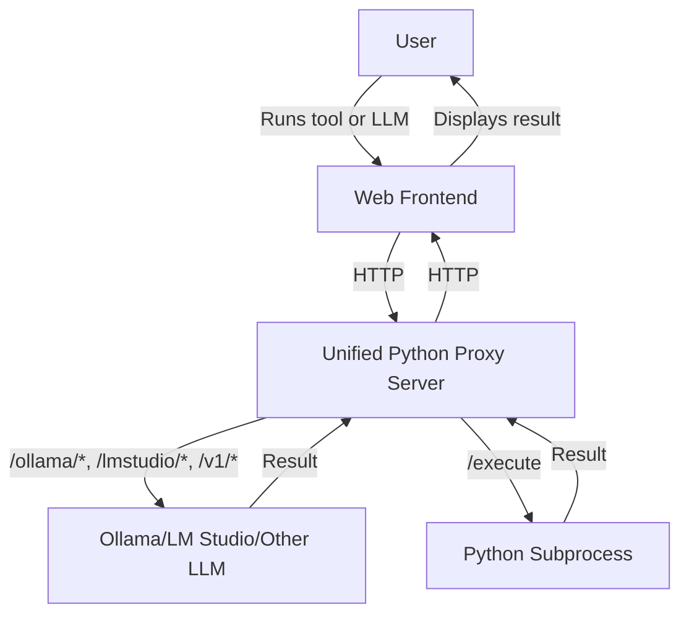

# Unified Local Proxy Server Design (Python)

## Overview

This document describes the design for a unified local proxy server, implemented in Python, that serves two purposes:
- **Proxying requests to local LLMs** (Ollama, LM Studio, OpenAI-compatible endpoints) with CORS support, replacing the Node.js `local-llm-proxy.cjs`.
- **Executing user-supplied Python code** securely on the user's machine via a `/execute` endpoint.

The goal is to provide a single, easy-to-run, cross-platform Python script for all local AI and tool execution needs.

---

## User Flow

1. **User downloads the Python script** (e.g., `local-llm-proxy.py`).
2. **User runs the script:**  
   `python local-llm-proxy.py [options]`
3. **Script starts a local HTTP server** (Flask or FastAPI) on a configurable port (default: 3500).
4. **Frontend detects the server** (via a `/health` endpoint).
5. **Frontend routes requests:**
   - LLM API requests (Ollama, LM Studio, OpenAI-compatible) are proxied to the appropriate local service.
   - Tool execution requests are sent to `/execute` and run as Python code locally.
6. **Results are returned to the frontend and displayed to the user.**

---

## Architecture Diagram



---

## Proxy Server Features

### 1. LLM Proxy Endpoints

- `/ollama/*` → Proxies to Ollama (default port 11434, or custom base URL)
- `/lmstudio/*` and `/v1/*` → Proxies to LM Studio (default port 1234, or custom base URL)
- **CORS:** Adds `Access-Control-Allow-Origin: *` and other necessary headers to all responses.
- **OPTIONS:** Handles preflight requests for CORS.
- **Custom Base URLs:** Supports command-line options for custom LLM endpoints.

### 2. Tool Code Execution Endpoint

- `POST /execute`
  - Body: `{ "code": "...", "input": {...} }`
  - Runs the provided Python code in a subprocess (with resource/time limits).
  - Returns: `{ "output": "...", "error": "...", "success": true/false }`
- **Security:** Only listens on `localhost`. Warns user about risks. Uses timeouts and can be extended with resource limits.

### 3. Health Check

- `GET /health` → Returns "ok" for frontend detection.

### 4. Command-Line Options

- `--port <number>`: Proxy server port (default: 3500)
- `--ollama-port <number>`: Ollama port (default: 11434)
- `--lmstudio-port <number>`: LM Studio port (default: 1234)
- `--ollama-base-url <url>`: Custom Ollama base URL
- `--lmstudio-base-url <url>`: Custom LM Studio base URL
- `--debug`: Enable debug logging

---

## Example Python Implementation (Flask)

```python
from flask import Flask, request, jsonify, Response
import requests
import subprocess
import tempfile
import os

app = Flask(__name__)

# Configurable ports and base URLs
PROXY_PORT = 3500
OLLAMA_PORT = 11434
LMSTUDIO_PORT = 1234
OLLAMA_BASE_URL = None
LMSTUDIO_BASE_URL = None

@app.after_request
def add_cors_headers(response):
    response.headers['Access-Control-Allow-Origin'] = '*'
    response.headers['Access-Control-Allow-Methods'] = 'GET, POST, PUT, DELETE, OPTIONS'
    response.headers['Access-Control-Allow-Headers'] = 'Content-Type, Authorization, X-Requested-With, Origin'
    response.headers['Access-Control-Allow-Credentials'] = 'true'
    response.headers['Access-Control-Max-Age'] = '86400'
    return response

@app.route('/health', methods=['GET'])
def health():
    return 'ok', 200

@app.route('/execute', methods=['POST'])
def execute():
    data = request.get_json()
    code = data.get('code')
    input_data = data.get('input', {})
    with tempfile.NamedTemporaryFile('w', delete=False, suffix='.py') as f:
        f.write(code)
        code_path = f.name
    try:
        result = subprocess.run(
            ['python3', code_path],
            input=str(input_data),
            capture_output=True,
            text=True,
            timeout=10
        )
        return jsonify({
            'output': result.stdout,
            'error': result.stderr,
            'success': result.returncode == 0
        })
    except Exception as e:
        return jsonify({'output': '', 'error': str(e), 'success': False})
    finally:
        os.remove(code_path)

def proxy_request(target_url):
    method = request.method
    headers = {key: value for key, value in request.headers if key.lower() != 'host'}
    data = request.get_data()
    resp = requests.request(method, target_url, headers=headers, data=data, stream=True)
    excluded_headers = ['content-encoding', 'content-length', 'transfer-encoding', 'connection']
    headers = [(name, value) for (name, value) in resp.raw.headers.items() if name.lower() not in excluded_headers]
    return Response(resp.content, resp.status_code, headers)

@app.route('/ollama/<path:path>', methods=['GET', 'POST', 'PUT', 'DELETE', 'OPTIONS'])
def proxy_ollama(path):
    base = OLLAMA_BASE_URL or f'http://localhost:{OLLAMA_PORT}'
    return proxy_request(f'{base}/{path}')

@app.route('/lmstudio/<path:path>', methods=['GET', 'POST', 'PUT', 'DELETE', 'OPTIONS'])
def proxy_lmstudio(path):
    base = LMSTUDIO_BASE_URL or f'http://localhost:{LMSTUDIO_PORT}'
    return proxy_request(f'{base}/{path}')

@app.route('/v1/<path:path>', methods=['GET', 'POST', 'PUT', 'DELETE', 'OPTIONS'])
def proxy_v1(path):
    base = LMSTUDIO_BASE_URL or f'http://localhost:{LMSTUDIO_PORT}'
    return proxy_request(f'{base}/v1/{path}')

if __name__ == '__main__':
    app.run(port=PROXY_PORT)
```

---

## Security & UX Considerations

- **Warn users:** Only run code you trust. This server executes arbitrary Python code.
- **Resource limits:** Use `timeout`, restrict memory/CPU if possible.
- **Port conflicts:** Allow user to change port if needed.
- **Cross-platform:** Works on Windows, Mac, Linux with Python 3.

---

## Migration Steps

1. Replace `local-llm-proxy.cjs` with the new Python script.
2. Update documentation and download links in the frontend.
3. Test all LLM proxy and tool execution features.
4. Provide clear user instructions for running the new script.

---

## Future Extensions

- Add support for more LLMs or tool languages.
- Add authentication or access control if needed.
- Improve sandboxing for code execution.

---