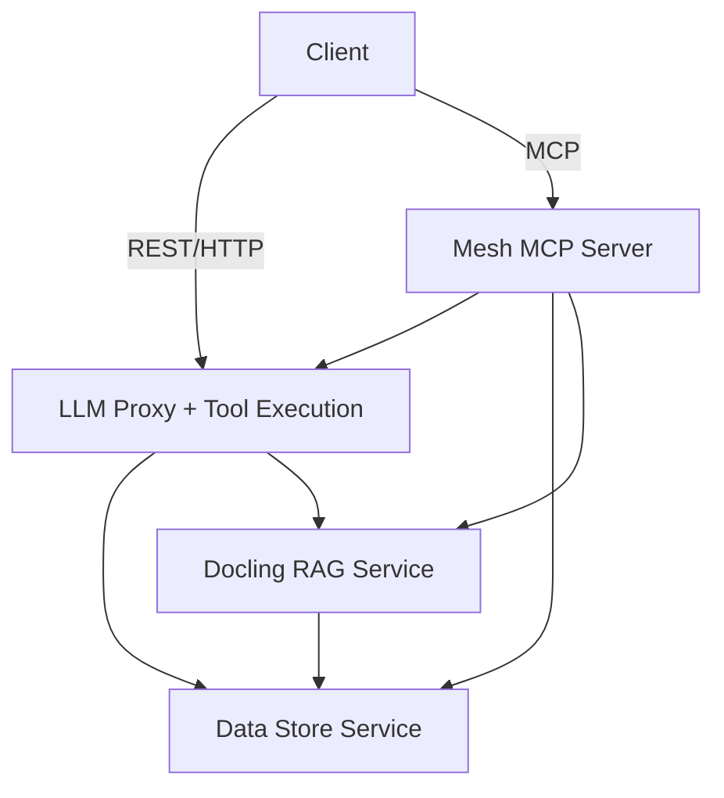
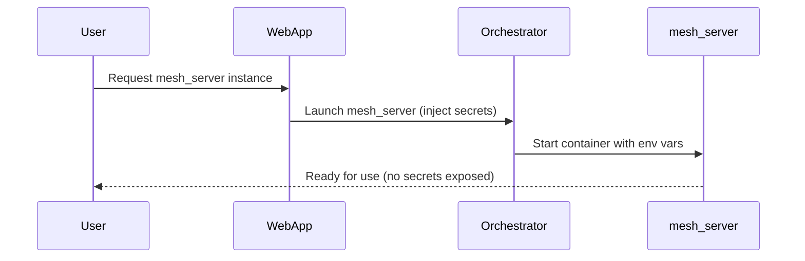

# Proxy Server System: LLM Proxy, Data Store, and Docling RAG

## Overview

This system provides a modular, production-ready architecture for GenAI and RAG (Retrieval-Augmented Generation) applications. It consists of four main services:

- **LLM Proxy & Dynamic Tool Execution:** Unified, secure proxy for LLM API requests and dynamic tool execution.
- **Data Store:** Backend-agnostic vector database service for storing and retrieving embeddings and metadata.
- **Docling RAG:** Document processing and knowledge extraction pipeline for chunking, embedding, and preparing documents for RAG.
- **Mesh MCP Server:** Model Context Protocol server that provides unified access to all mesh server capabilities.

Each service is designed to run independently, enabling flexible deployment and scaling.

---

## Features

### 1. LLM Proxy & Dynamic Tool Execution

- **Unified LLM Endpoint:** Forwards requests to multiple LLM providers (OpenAI, Google, Ollama, etc.).
- **Provider-Specific Handling:** Formats requests and responses for each provider.
- **Authentication & Rate Limiting:** Uses JWT-based authentication and rate limiting.
- **Dynamic Tool Execution:** `/execute` endpoint for running custom tool code.

### 2. Data Store

- **Backend-Agnostic Storage:** Supports multiple backends (e.g., FileMaker, Supabase, LanceDB) for vector embeddings and metadata.
- **RESTful API:** CRUD operations for vector records, metadata, and search.
- **Integration Point:** Acts as the persistent storage layer for RAG pipelines and LLM applications.

### 3. Docling RAG

- **Document Ingestion:** Processes PDF, DOCX, XLSX, PPTX, Markdown, HTML, images, and more.
- **AI-Powered Chunking:** Advanced layout analysis and table structure recognition.
- **Embedding Generation:** Prepares and embeds document chunks for storage in the Data Store.
- **RAG Pipeline:** Enables enterprise document search, passage retrieval, and knowledge extraction.

### 4. Mesh MCP Server

The Mesh MCP Server provides a unified interface to all mesh server capabilities through the Model Context Protocol (MCP). It exposes the following tools:

#### LLM Proxy Tools
- **llm_chat:** Execute chat completions with any provider/model
  - Input: provider, model, messages, optional user_id
  - Output: LLM chat response

- **llm_embed:** Generate embeddings from text
  - Input: provider, model, text, optional user_id
  - Output: Embedding vector

#### Data Store Tools
- **store_record:** Store embedding vectors with metadata
  - Input: embedding vector, metadata, optional user_id
  - Output: Stored record details

- **search_records:** Search for similar embeddings with filters
  - Input: query embedding, optional metadata filter, limit, user_id
  - Output: Similar records with scores

#### Docling Tools
- **extract_from_url:** Extract content from a URL
  - Input: url, optional format (markdown/json)
  - Output: Extracted document content

- **extract_from_file:** Extract content from a local file
  - Input: file_path, optional format (markdown/json)
  - Output: Extracted document content

- **extract_from_sitemap:** Extract content from multiple pages via sitemap
  - Input: base url, optional sitemap filename
  - Output: Array of extracted documents

- **chunk_document:** Break documents into smaller chunks
  - Input: document content, format, optional user_id
  - Output: Array of chunks with metadata

- **process_url:** Extract and chunk a document from URL in one step
  - Input: url, optional user_id
  - Output: Document metadata and chunks

- **process_file:** Extract and chunk a local file in one step
  - Input: file_path, optional user_id
  - Output: Document metadata and chunks

- **cleanup_temp_files:** Clean up temporary processing files
  - Input: file_id
  - Output: Cleanup confirmation

---

## Architecture



---

## Deployment: 4-Container Approach

For production, it is recommended to deploy each service in its own Docker container:

1. **LLM Proxy + Tool Execution Container**
    - Handles LLM API proxying and dynamic tool execution.
    - Exposes endpoints for LLM requests and tool execution.

2. **Data Store Container**
    - Manages vector embedding storage and retrieval.
    - Supports multiple backend databases.

3. **Docling RAG Container**
    - Handles document ingestion, chunking, and embedding.
    - Feeds processed embeddings into the Data Store.

4. **Mesh MCP Container**
    - Provides unified MCP interface to all services.
    - Handles tool routing and response formatting.

This approach allows independent scaling, maintenance, and deployment of each service.

---

## Docker Deployment

The system is fully containerized and can be deployed using Docker and Docker Compose.

### Prerequisites

- Docker and Docker Compose installed
- Environment variables set (or use a .env file)

### Secure Multi-User Deployment

This system is designed for secure, multi-user deployment where:
- **No user needs to modify any configuration files**
- **Sensitive values are never visible to end users**
- **Users simply download and run pre-built images**
- **All sensitive config is injected at runtime**
- **Fast installation with uv package manager**

#### Pre-built Docker Images

Pre-built Docker images are available for all mesh_server services:

```bash
# Pull the latest images
docker pull yourorg/mesh-server-proxy:latest
docker pull yourorg/mesh-server-data-store:latest
docker pull yourorg/mesh-server-docling:latest
docker pull yourorg/mesh-server-mcp:latest
```

#### Performance Optimizations

The mesh_server uses several performance optimizations:

1. **uv Package Manager**: All Python dependencies are installed using [uv](https://github.com/astral-sh/uv), a significantly faster alternative to pip:
   ```dockerfile
   # Install uv and use it to install dependencies
   RUN pip install --no-cache-dir uv
   RUN uv pip install --system --no-cache-dir -r requirements.txt
   ```

2. **Optimized Docker Images**: Multi-stage builds and minimal base images reduce container size
3. **Efficient Dependency Management**: Dependencies are installed in a separate layer for better caching

#### Runtime Environment Injection

All sensitive configuration is injected at runtime by the orchestrator or web app:

```yaml
# Example Docker Compose configuration (managed by the web app, not users)
services:
  proxy:
    image: yourorg/mesh-server-proxy:latest
    environment:
      - JWT_SECRET=${JWT_SECRET}
      - SUPABASE_URL=${SUPABASE_URL}
      - SUPABASE_SERVICE_ROLE_KEY=${SUPABASE_SERVICE_ROLE_KEY}
      - HOST=0.0.0.0
```

#### API Key Management

The system supports two ways to provide API keys for LLM providers:

1. **Supabase Integration**: API keys are stored in a Supabase database table (`key_store`) per user
2. **Request-time**: API keys can be provided directly in the request body (for testing only)

The system will check for API keys in the following order:
1. Request body (highest priority, for testing only)
2. Supabase database (if user_id is available, recommended for production)

**Note**: Environment variables are NOT used for API keys to ensure proper multi-user isolation.

### Running with Docker Compose

1. Build and start all services:
   ```bash
   docker-compose up --build
   ```

2. Start in detached mode:
   ```bash
   docker-compose up -d
   ```

3. View logs:
   ```bash
   docker-compose logs -f
   ```

4. Stop all services:
   ```bash
   docker-compose down
   ```

### Multi-User Setup

This system is designed for secure, multi-user environments where each user runs their own mesh_server instance without needing to configure anything. Key features:

1. **User-Specific API Keys**: Each user's API keys are stored in Supabase and retrieved based on user_id
2. **Zero Configuration**: Users don't need to edit any files or set any environment variables
3. **JWT Authentication**: Secure authentication with JWT tokens
4. **Stateless Design**: The proxy service is stateless regarding user API keys
5. **No Exposed Secrets**: Sensitive values are never visible to end users
6. **Inter-Service Authentication**: Secure communication between services using JWT tokens

#### Deployment Options for Multi-User Environments

##### 1. **Web App Orchestrated Deployment** (Recommended)

The web app automatically launches mesh_server instances for users:



Implementation:
```javascript
// Example web app code to launch a user's mesh_server instance
async function launchMeshServer(userId) {
  // Get secrets from secure storage (not visible to user)
  const secrets = await getSecureConfig();
  
  // Launch container with Docker API or similar
  const container = await docker.createContainer({
    Image: 'yourorg/mesh-server-proxy:latest',
    Env: [
      `JWT_SECRET=${secrets.JWT_SECRET}`,
      `SUPABASE_URL=${secrets.SUPABASE_URL}`,
      `SUPABASE_SERVICE_ROLE_KEY=${secrets.SUPABASE_SERVICE_ROLE_KEY}`,
      `USER_ID=${userId}`,
      'HOST=0.0.0.0'
    ],
    ExposedPorts: { '3500/tcp': {} }
  });
  
  await container.start();
  return container.id;
}
```

##### 2. **One-Click User Installation**

Provide users with a simple installation script or application:

```bash
# User runs this single command
curl -sSL https://get.your-org.com/mesh-server | bash

# Or with a desktop application
# User simply clicks "Install" and the app handles everything
```

The installation script:
1. Pulls the pre-built Docker images
2. Launches the containers with the correct configuration
3. Connects to the web app to get necessary (non-sensitive) configuration
4. Never exposes sensitive values to the user

##### 3. **Kubernetes or Cloud Deployment**

For enterprise deployments, use Kubernetes or cloud services:

```yaml
# Example Kubernetes manifest template (not seen by users)
apiVersion: apps/v1
kind: Deployment
metadata:
  name: mesh-server-{{.UserId}}
spec:
  replicas: 1
  selector:
    matchLabels:
      app: mesh-server
      user: {{.UserId}}
  template:
    metadata:
      labels:
        app: mesh-server
        user: {{.UserId}}
    spec:
      containers:
      - name: proxy
        image: yourorg/mesh-server-proxy:latest
        env:
        - name: JWT_SECRET
          valueFrom:
            secretKeyRef:
              name: mesh-server-secrets
              key: jwt-secret
        - name: SUPABASE_URL
          valueFrom:
            secretKeyRef:
              name: mesh-server-secrets
              key: supabase-url
        - name: SUPABASE_SERVICE_ROLE_KEY
          valueFrom:
            secretKeyRef:
              name: mesh-server-secrets
              key: supabase-service-role-key
        - name: USER_ID
          value: {{.UserId}}
```

#### Supabase Integration for API Key Management

The system uses Supabase to securely store and retrieve user-specific API keys:

1. **Database Schema**:
   Create a `key_store` table in your Supabase database:
   ```sql
   CREATE TABLE key_store (
     id UUID PRIMARY KEY DEFAULT uuid_generate_v4(),
     user_id UUID NOT NULL REFERENCES auth.users(id),
     provider TEXT NOT NULL,
     api_key TEXT NOT NULL,
     created_at TIMESTAMPTZ NOT NULL DEFAULT NOW(),
     UNIQUE(user_id, provider)
   );

   -- Add RLS policies to ensure users can only access their own keys
   CREATE POLICY "Users can only view their own keys"
     ON key_store FOR SELECT
     USING (auth.uid() = user_id);

   CREATE POLICY "Users can only insert their own keys"
     ON key_store FOR INSERT
     WITH CHECK (auth.uid() = user_id);

   CREATE POLICY "Users can only update their own keys"
     ON key_store FOR UPDATE
     USING (auth.uid() = user_id);

   CREATE POLICY "Users can only delete their own keys"
     ON key_store FOR DELETE
     USING (auth.uid() = user_id);
   ```

2. **Secure Key Storage**:
   - API keys are stored encrypted in the database
   - Only the mesh_server service has access to the keys via the service role key
   - Users never see their own API keys after storing them

3. **Key Retrieval Flow**:
   ```mermaid
   sequenceDiagram
       participant User
       participant WebApp
       participant mesh_server
       participant Supabase
       participant LLMProvider

       User->>WebApp: Make LLM request
       WebApp->>mesh_server: Forward request with JWT (contains user_id)
       mesh_server->>Supabase: Get API key for user_id and provider
       Supabase-->>mesh_server: Return API key
       mesh_server->>LLMProvider: Make request with API key
       LLMProvider-->>mesh_server: Return response
       mesh_server-->>WebApp: Return formatted response
       WebApp-->>User: Display result
   ```

4. **Security Considerations**:
   - The Supabase service role key is never exposed to end users
   - It's injected at runtime by the orchestrator or web app
   - All API key operations are logged and auditable

#### Inter-Service Authentication

The system implements secure authentication between services:

1. **JWT-Based Authentication**:
   - All services use the same JWT_SECRET for token validation
   - User identity is propagated between services via JWT tokens
   - Service-to-service calls use special service tokens when needed

2. **Authentication Flow**:
   ```mermaid
   sequenceDiagram
       participant User
       participant WebApp
       participant llm-proxy
       participant docling
       participant data_store

       User->>WebApp: Request (with JWT)
       WebApp->>llm-proxy: Forward request (with JWT)
       llm-proxy->>Supabase: Get API key (user_id from JWT)
       llm-proxy->>data_store: Request (with JWT)
       WebApp->>docling: Request (with JWT)
       docling->>llm-proxy: Forward request (with JWT)
       docling->>data_store: Request (with JWT)
       data_store->>Supabase: (optional) Enforce RLS by user_id
   ```

3. **Service Token Creation**:
   - When a user JWT is not available, services create service-to-service tokens
   - Service tokens include the service name and optional user_id for user-scoped operations
   - Tokens have a short expiration time (1 hour) for security

4. **User Identity Propagation**:
   - User identity (user_id) is extracted from JWT and made available in request context
   - User identity is propagated to downstream services via JWT
   - This enables per-user access control and data isolation

5. **Security Considerations**:
   - All inter-service communication is authenticated
   - User data is isolated by user_id
   - Service tokens are only created when necessary
   - JWT_SECRET is never exposed to end users

### Web App Integration

The web app is responsible for both launching mesh_server instances and connecting to them:

#### 1. **Launching mesh_server Instances**

```javascript
// Web app backend code (Node.js example)
import Docker from 'dockerode';

// Function to launch a mesh_server instance for a user
async function launchMeshServerForUser(userId) {
  const docker = new Docker();
  
  // Get secrets from secure storage (environment variables, vault, etc.)
  const JWT_SECRET = process.env.JWT_SECRET;
  const SUPABASE_URL = process.env.SUPABASE_URL;
  const SUPABASE_KEY = process.env.SUPABASE_SERVICE_ROLE_KEY;
  
  // Create a unique container name for this user
  const containerName = `mesh-server-${userId}`;
  
  // Launch the container with secrets injected
  const container = await docker.createContainer({
    Image: 'yourorg/mesh-server-proxy:latest',
    name: containerName,
    Env: [
      `JWT_SECRET=${JWT_SECRET}`,
      `SUPABASE_URL=${SUPABASE_URL}`,
      `SUPABASE_SERVICE_ROLE_KEY=${SUPABASE_KEY}`,
      'HOST=0.0.0.0'
    ],
    ExposedPorts: {
      '3500/tcp': {}
    },
    HostConfig: {
      PortBindings: {
        '3500/tcp': [{ HostPort: '0' }] // Dynamically assign a port
      }
    }
  });
  
  await container.start();
  
  // Get the assigned port
  const containerInfo = await container.inspect();
  const port = containerInfo.NetworkSettings.Ports['3500/tcp'][0].HostPort;
  
  // Store the container ID and port in your database
  await db.userMeshServers.upsert({
    userId,
    containerId: container.id,
    port,
    url: `http://localhost:${port}`
  });
  
  return {
    containerId: container.id,
    port,
    url: `http://localhost:${port}`
  };
}
```

#### 2. **Connecting to mesh_server Instances**

```javascript
// Web app frontend code (React example)
import { useState, useEffect } from 'react';
import { useAuth } from './auth';

function LLMChat() {
  const { user, getToken } = useAuth();
  const [meshServerUrl, setMeshServerUrl] = useState(null);
  const [message, setMessage] = useState('');
  const [response, setResponse] = useState('');
  
  // Get the mesh_server URL for this user
  useEffect(() => {
    async function getMeshServerUrl() {
      const res = await fetch('/api/mesh-server-url');
      const data = await res.json();
      setMeshServerUrl(data.url);
    }
    getMeshServerUrl();
  }, [user]);
  
  async function sendMessage() {
    if (!meshServerUrl) return;
    
    // Get a JWT token with the user_id
    const token = await getToken();
    
    const response = await fetch(`${meshServerUrl}/llm`, {
      method: 'POST',
      headers: {
        'Content-Type': 'application/json',
        'Authorization': `Bearer ${token}`
      },
      body: JSON.stringify({
        provider: 'openai',
        type: 'chat',
        model: 'gpt-4',
        messages: [
          { role: 'user', content: message }
        ]
      })
    });
    
    const data = await response.json();
    setResponse(data.content);
  }
  
  // Rest of component...
}
```

#### 3. **Managing mesh_server Lifecycle**

```javascript
// Web app backend code
async function stopMeshServer(userId) {
  const docker = new Docker();
  const { containerId } = await db.userMeshServers.findOne({ userId });
  
  if (containerId) {
    const container = docker.getContainer(containerId);
    await container.stop();
    await container.remove();
    await db.userMeshServers.delete({ userId });
  }
}

// Stop containers when users log out or sessions expire
app.post('/api/logout', async (req, res) => {
  await stopMeshServer(req.user.id);
  // Rest of logout logic...
});
```

### Service Endpoints

- **LLM Proxy**: http://localhost:3500
  - `/health` - Health check endpoint
  - `/llm` - Unified LLM proxy endpoint
  - `/execute` - Tool execution endpoint

- **Data Store**: http://localhost:3550
  - `/api/data-store/health` - Health check endpoint
  - `/api/data-store/config` - Configuration endpoint
  - `/api/data-store/records` - CRUD operations for vector records
  - `/api/data-store/search` - Search endpoint

- **Docling RAG**: http://localhost:3600
  - `/docling/health` - Health check endpoint
  - Various document processing endpoints

- **Mesh MCP Server**: stdio transport
  - Uses stdio for communication with MCP clients
  - Provides unified access to all services via MCP tools
  - Exposes tools for LLM operations, data store access, and document processing
  - No HTTP endpoints (accessed through MCP protocol)

---

## File Overview

- **docker-compose.yml**: Docker Compose configuration for all services
- **Dockerfile**: Dockerfile for the LLM Proxy service
- **llm-proxy.py**: Main proxy server implementation (LLM proxy + tool execution)
- **requirements.txt**: Python dependencies for the proxy service
- **.env.example**: Example environment variables configuration
- **data_store/**: Backend implementations for vector storage and API:
  - **Dockerfile**: Dockerfile for the Data Store service
  - **app.py**: Entry point for the Data Store service
  - **api.py**: REST API for data store operations
  - **requirements.txt**: Python dependencies for the data store service
  - **base.py**: Base class for data store implementations
  - **factory.py**: Factory for creating data store instances
  - **filemaker.py, postgres.py, supabase.py, lancedb.py**: Backend implementations
- **docling/**: Document processing and RAG pipeline
  - **Dockerfile**: Dockerfile for the Docling service
  - **api.py**: REST API for document processing
- **mesh_mcp_server.py**: MCP server implementation
- **mesh_mcp.Dockerfile**: Dockerfile for the MCP server
- **requirements.txt**: Python dependencies

---

## Notes

- Each service can be run and scaled independently
- Communication between services occurs over network APIs
- Health checks are implemented for all services to ensure proper container orchestration
- For more details on specific endpoints and usage, refer to the code and comments in each file