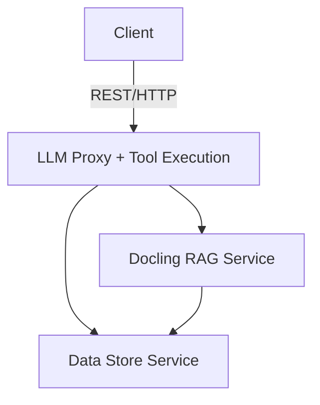

# Proxy Server System: LLM Proxy, Data Store, and Docling RAG

## Overview

This system provides a modular, production-ready architecture for GenAI and RAG (Retrieval-Augmented Generation) applications. It consists of three main services:

- **LLM Proxy & Dynamic Tool Execution:** Unified, secure proxy for LLM API requests and dynamic tool execution.
- **Data Store:** Backend-agnostic vector database service for storing and retrieving embeddings and metadata.
- **Docling RAG:** Document processing and knowledge extraction pipeline for chunking, embedding, and preparing documents for RAG.

Each service is designed to run independently, enabling flexible deployment and scaling.

---

## Features

### 1. LLM Proxy & Dynamic Tool Execution

- **Unified LLM Endpoint:** Forwards requests to multiple LLM providers (OpenAI, Google, Ollama, etc.).
- **Provider-Specific Handling:** Formats requests and responses for each provider.
- **Authentication & Rate Limiting:** Uses JWT-based authentication and rate limiting.
- **Dynamic Tool Execution:** `/execute` endpoint for running custom tool code.

### 2. Data Store

- **Backend-Agnostic Storage:** Supports multiple backends (e.g., FileMaker, Supabase, LanceDB) for vector embeddings and metadata.
- **RESTful API:** CRUD operations for vector records, metadata, and search.
- **Integration Point:** Acts as the persistent storage layer for RAG pipelines and LLM applications.

### 3. Docling RAG

- **Document Ingestion:** Processes PDF, DOCX, XLSX, PPTX, Markdown, HTML, images, and more.
- **AI-Powered Chunking:** Advanced layout analysis and table structure recognition.
- **Embedding Generation:** Prepares and embeds document chunks for storage in the Data Store.
- **RAG Pipeline:** Enables enterprise document search, passage retrieval, and knowledge extraction.

---

## Architecture

---

## Deployment: 3-Container Approach

For production, it is recommended to deploy each service in its own Docker container:

1. **LLM Proxy + Tool Execution Container**
    - Handles LLM API proxying and dynamic tool execution.
    - Exposes endpoints for LLM requests and tool execution.

2. **Data Store Container**
    - Manages vector embedding storage and retrieval.
    - Supports multiple backend databases.

3. **Docling RAG Container**
    - Handles document ingestion, chunking, and embedding.
    - Feeds processed embeddings into the Data Store.

This approach allows independent scaling, maintenance, and deployment of each service.

---

## File Overview

- **local-llm-proxy.py**: Main proxy server implementation (LLM proxy + tool execution).
- **data_store/**: Backend implementations for vector storage and API:
  - **api.py**: REST API for data store operations.
  - **base.py**: Base class for data store implementations.
  - **factory.py**: Factory for creating data store instances.
  - **filemaker.py, postgres.py, supabase.py, lancedb.py**: Backend implementations.
- **docling/**: Document processing and RAG pipeline.
- **requirements.txt**: Python dependencies.

---

## Notes

- Each service can be run and scaled independently.
- Communication between services occurs over network APIs.
- For more details on specific endpoints and usage, refer to the code and comments in each file.