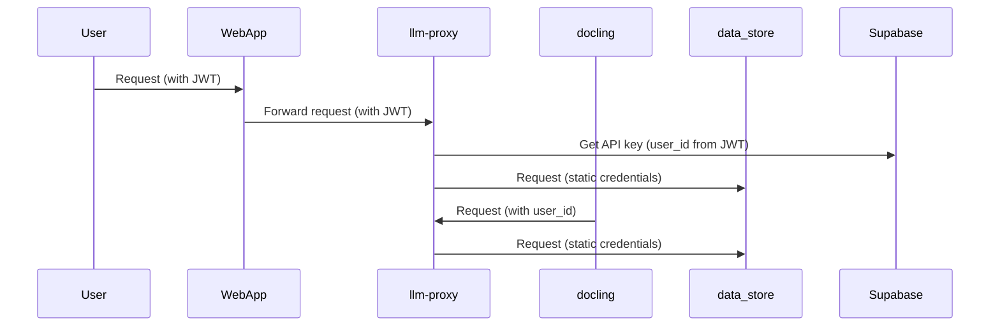
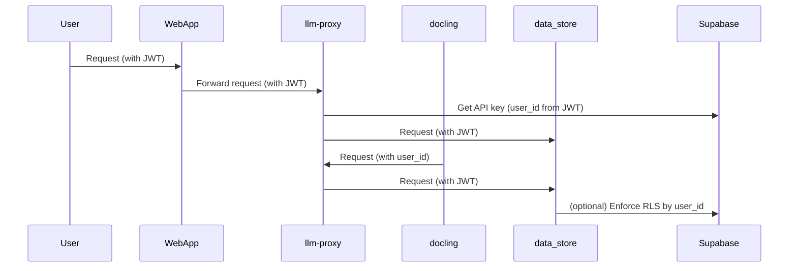

# Inter-Service Authentication Review and Recommendations

## 1. Current Authentication Processes

### A. llm-proxy

- **Authentication Method:**
  - Uses JWT-based authentication.
  - Requires `Authorization: Bearer <JWT>` header.
  - JWT is validated using a shared secret (`JWT_SECRET`).
  - User identity (`user_id`, `email`) is extracted from the JWT payload.
  - API keys for LLM providers are fetched from Supabase, scoped per user (`user_id`).
  - All main endpoints (`/llm`, `/execute`, provider proxies) are protected by the `@jwt_required` decorator.

- **Key Points:**
  - Stateless, per-user authentication.
  - No API keys in environment variables; all are user-specific and stored in Supabase.
  - Rate limiting is per user (if available), else per IP.

---

### B. docling

- **Authentication Method:**
  - Does **not** implement its own authentication.
  - Accepts an optional `user_id` parameter in requests.
  - For LLM/tokenization operations, docling **delegates** to llm-proxy, passing `user_id`.
  - Relies on llm-proxy to enforce authentication, rate limiting, and API key management.

- **Key Points:**
  - Trust boundary is at the llm-proxy.
  - docling is not directly exposed to user credentials or JWTs.
  - All user-specific logic is handled by llm-proxy.

---

### C. data_store

- **Authentication Method:**
  - Uses static, per-service credentials (e.g., API key, username/password) provided in configuration.
  - Credentials are passed as part of the data store config (e.g., in a `credentials` dict).
  - No JWT validation or per-user authentication.
  - Each backend (Supabase, FileMaker, Postgres, LanceDB) uses its own connection/auth logic.

- **Key Points:**
  - Not user- or JWT-aware.
  - Credentials are typically set at service start or via config, not per request.

---

## 2. Incompatibility Points

| Service     | Auth Type         | User-Scoped | JWT-Aware | Inter-Service Auth |
|-------------|-------------------|-------------|-----------|--------------------|
| llm-proxy   | JWT (Bearer)      | Yes         | Yes       | Yes                |
| docling     | Delegates to proxy| Yes (via proxy) | No    | Yes (via proxy)    |
| data_store  | Static credentials| No          | No        | No                 |

**Incompatibilities:**
- **data_store** is not JWT-aware and cannot enforce per-user access or validate tokens.
- If docling or llm-proxy need to access data_store on behalf of a user, there is no way to propagate user identity or enforce user-level access control.
- data_store cannot distinguish between requests from different users or services.

---

## 3. Recommendations for Interoperability

### A. Make data_store JWT-Aware (Recommended)

- **Add JWT validation to data_store API endpoints.**
  - Require `Authorization: Bearer <JWT>` header for all API calls.
  - Validate JWT using the same `JWT_SECRET` as llm-proxy.
  - Extract `user_id` from JWT for per-user logic (if needed).
- **Optionally, support service-to-service tokens.**
  - Allow trusted services (e.g., llm-proxy, docling) to authenticate using a shared secret or service JWT.
  - Use claims in the JWT to distinguish between user and service requests.

### B. Propagate User Identity

- When llm-proxy or docling calls data_store, always include the user's JWT (or a signed service JWT with user_id as a claim).
- data_store should use the `user_id` to enforce row-level security or filter data as appropriate.

### C. Update Credentials Handling

- For backends that support it (e.g., Supabase), use per-user API keys or row-level security policies.
- For legacy backends (e.g., FileMaker), consider a service account but log and audit all access by user_id.

### D. Document Auth Flows

- Create clear documentation and diagrams for:
  - User → Web App → llm-proxy → data_store
  - User → Web App → docling → llm-proxy → data_store

---

## 4. Mermaid Diagram: Current vs. Recommended Auth Flows

### Current Flow

### Recommended Flow

---

## 5. Next Steps

1. Confirm this documentation and recommendations.
2. Plan implementation steps for making data_store JWT-aware and updating inter-service calls.

---

## 6. Implementation Tasks

### 6.1. Make data_store JWT-Aware

- [ ] Add JWT validation middleware to all data_store API endpoints.
- [ ] Use the same `JWT_SECRET` as llm-proxy for validation.
- [ ] Extract `user_id` from JWT and make it available in request context.
- [ ] Return appropriate error codes for missing/invalid/expired JWTs.

### 6.2. Update Inter-Service Calls

- [ ] Update llm-proxy and docling to always include the user's JWT when calling data_store.
- [ ] For service-to-service calls, define and use a service JWT or shared secret as needed.

### 6.3. Enforce Row-Level Security (RLS) Where Supported (verify prior to making changes)

- [ ] For Supabase, implement RLS policies using `user_id` from JWT.
- [ ] For other backends, log and audit all access by `user_id` (if per-user RLS is not possible).

### 6.4. Documentation and Testing

- [ ] Update API documentation to reflect new authentication requirements for data_store.
- [ ] Add examples for authenticated inter-service requests.
- [ ] Write integration tests for all new authentication flows and error cases.

### 6.5. Deployment and Rollout

- [ ] Stage changes in a development environment.
- [ ] Communicate new requirements to all service owners.
- [ ] Monitor logs for authentication errors and adjust as needed.

---